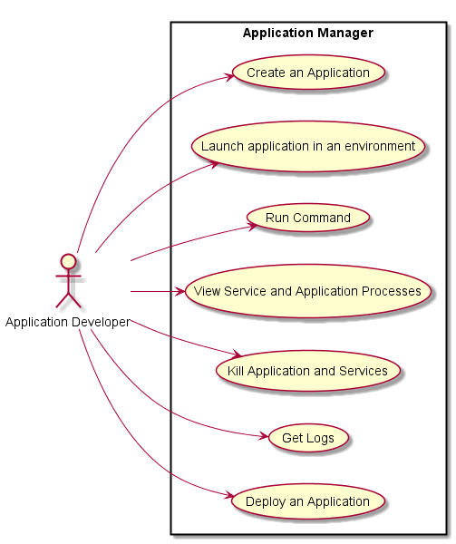

# Application Developer
The Application Developer develops cloud aware applications.

## Use Cases
* Create an Application
* Launch application in an environment
* Run command 
* View Service and Application processes
* Kill Application and Services
* Get logs
* Deploy an application


## User Interface
TBD

## Command Line
Examples on how to use Caade

### Create an Application
```
caade create-app <application name> --stack=<ApplicationStack>
```

### Launch an Application in an environment
* Launch application on local machine
```
# caade launch --env=local
```
* Launch application on cloud in the development environment 
```
# caade launch --env=dev
```
* Launch application on cloud in the test environment 
```
# caade launch --env=test
```
* Launch application on cloud in the production environment 
```
# caade launch --env=prod
```
* Launch application on cloud in the "generic" environment 
```
# caade launch --env=<Environment Name>
```
The [Operations Engineer](../OperationsManager/overview.md) is responsible for naming and creating environments.

### Run a Command
Running a command might not seem like it makes sense in the case of an application, but there are several times when
a developer will want to test, or control their application while they are developing it. All commands are run in the
same security context and environment as the application is currently running or you can specify. You can also specify
that you want the command executed in the same container or machine as a specific service or process of a service.
* Run command in same environment as application
```
# caade run "echo 'hello world'"
```
* Run command in specified environment for the application
```
# caade run --env=test "echo 'hello world'"
# caade run --env=<Environment Name> "echo 'hello world'"
```
* Run Command in all containers, VMs, or machines of specific service 
This will run echo 'hello world' on every machine that has a redis service running for the application.
```
# caade run --service=redis "echo 'hello world'"
```
* Run Command in a container, VM, or machine of specific service process
This will run echo 'hello world' on every machine that has a redis service running for the application.
```
# caade run --service=redis.23143 "echo 'hello world'"
```

### View Service and Application Processes
* Show processes for application
```
# caade ps
ID      Name        Command      State     
======  =========== ============ ==========
23143   redis       ./redis ...  Running
23144   redis       ./redis ...  Running
23145   redis       ./redis ...  Running
23146   mongo       ./mongo ...  Running
23147   worker      npm ...      Running
23148   worker      npm ...      Exit 0
23149   worker      npm ...      Starting
```

### Kill Application
* Kill all services on for the application
```
# caade kill
```
* Kill specific service for the application
```
# caade kill <Service_Name>
# caade kill redis # kill redis - all processes running service
# caade kill redis.23412 # kill redis - only the process with the process id.
# caade kill 23412 # kill only the process with the process id.
```
### Get Logs
* Get logs of the application
```
# caade logs
```
* Get logs of specific service
```
# caade logs redis
```
* Get logs of specific process for the service
```
# caade logs redis.23412
```
* Get specific log from machines that service processes are running
```
# caade logs redis --log=/var/syslog
```

* Get specific log from machine that service is running
```
# caade logs redis.223412 --log=/var/syslog
```

### Deploy an application
* Deploy an application
```
# caade deploy 
```
