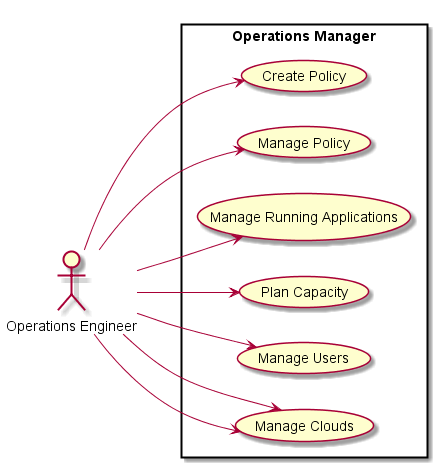

# Operations Manager
The Operation Manager is responsible for managing the operations of the system.
This includes the creation and management of environments, users, and connectivity to the Clouds.

## Use Cases
* Manage Environment
* Manage Policy
* Manage Applications
* Plan Capacity
* Manage Users
* Manage Clouds
* Map Cloud Resources


## User Interface
TBD

## Command Line
Examples on how to use CAADE for the Operations Manager

### Manage Environment

This is a set of commands that can used to create, update and remove an environment from the system.
Environments can represent Local machines, Development, Test, and Production. 
Operations Managers can creeate any number of environmentst that they need for the application and stack developers.

#### Create Environment

Create an environment with the name environmentName

```
# caade environment create <environmentName> --file <filenamee>
```

#### Update Environment

Update an Environment with the specification in the filename.
```
# caade environment update <environmentName> --file <filenamee>
```

#### Delete Enironment

Delete an Environment

```
# caade environment delete <environmentName>
```

#### List Enironments

List all of the environments and basic information about the environments.

```
# caade environment ls

Name          Applications   Running
============  ============== =======
Development    12              2
Test           12              4
Production     8               6
```

#### Environment Show Processes
```
# caade environment ps <environmentName>

ID      Name        Command      State
======  =========== ============ ==========
23143   redis       ./redis ...  Running
23144   redis       ./redis ...  Running
23145   redis       ./redis ...  Running
23146   mongo       ./mongo ...  Running
23147   worker      npm ...      Running
23148   worker      npm ...      Exit 0
23149   worker      npm ...      Starting
```

#### Environment Show

Show details about the environment given by the name environmentName

```
# caade envoronment show <environmentName>

```


### Manage Policies

#### Create Policy

#### List Policies

#### Update Policy

#### Remove Policy

#### Activate Policy

#### Deactivate Policy


### Manage Applications
#### List Application
#### Kill Application 

### Capacity Planning

### Manage Users
#### Add User
#### Modify User
#### Remove User
#### List User

### Manage Clouds
#### Add Cloud
#### Remove Cloud
#### List Clouds
#### Show Cloud

### Map Resources to Cloud
#### Map Images
#### Map Machine Types
#### Map Resources
