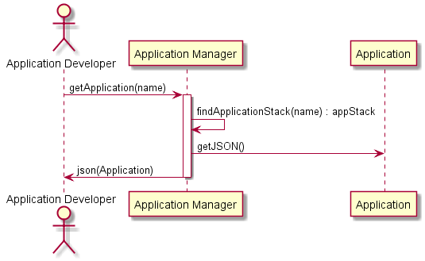

# Get Application Scenario
An Application Developer may want to connect to an existing application and clone 
the application definition. This allows then to connect to an application and "download" the
definition of the application into their current working directory. It is represented
as a set of yaml or json files.

## Interactions

### Users

* [Application Developer](../../Actors/ApplicationDeveloper/README.md) - See command line [examples](../../Actors/ApplicationDeveloper/README.md#get-an-application)

### Systems

* [Application Manager](../../ApplicationManager/README.md)
