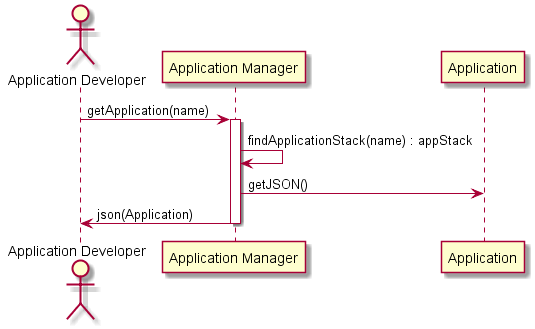

# Publish Application Scenario
An [Application Developer](../../Actors/ApplicationDeveloper/README.md) publishes the application 
to the Artifact Repository. This allows others to use the application. For production runs
or to clone and mirror for their own new application.

## Interactions

### Users

* [Application Developer](../../Actors/ApplicationDeveloper/README.md) - See command line [examples](../../Actors/ApplicationDeveloper/README.md#deploy-application)

### Systems

* [Artifact Repository](../../ArtifactRepository/README.md)
