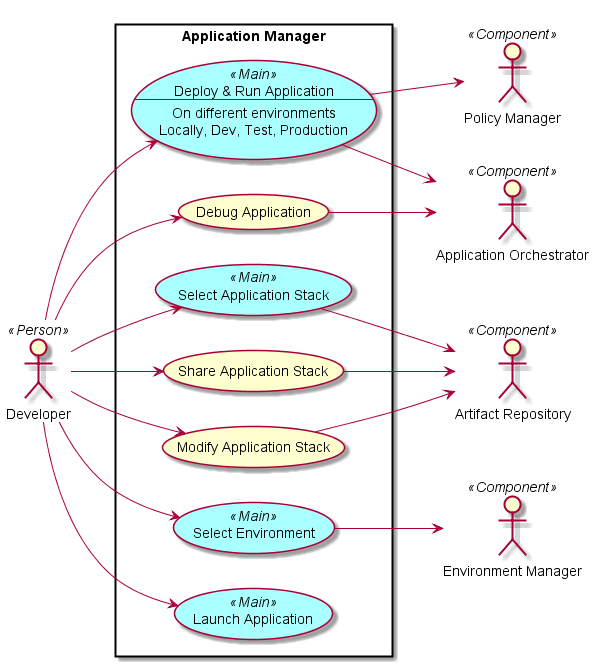
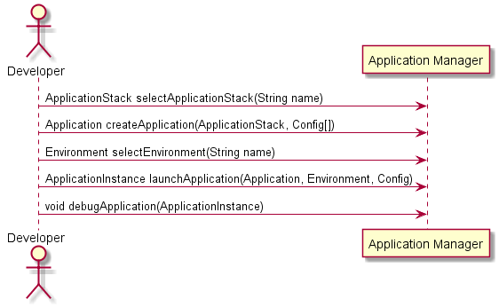
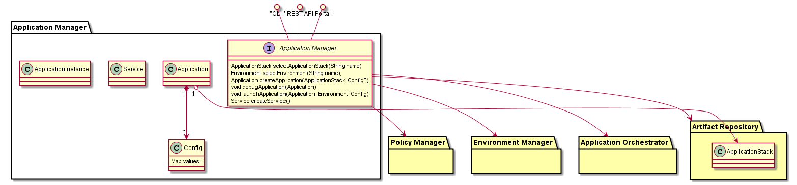

# Application Manager
Application Manager is the primary interface for the Application Developer for CAADE. 
It enables the developer to Use Application Stacks to rapidly develop, debug and deploy 
"Cloud Aware" applications.

## Use Cases
* Deploy and Run Application
* Select Application Stack
* Select Environment
* Debug Application
# Modify Application Stack

## Actors
Users 
* Application Developer

Uses
* Policy Manager
* Environment Manager
* Application Orchestrator
* Artifact Repository

## Interface
* CLI - Command Line Interface
* REST-API - 
* Portal - Web Portal

## Artifacts
* Application
* Service

## Services
*
