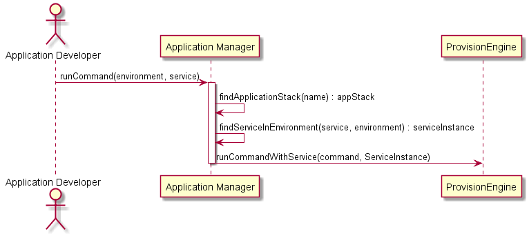

# Run Command Scenario

## Interactions
Application Developer interacts with the Application manager to run commands on the same
machine as the services or application are running in a specified environment.

### Users

* [Application Developer](../../Actors/ApplicationDeveloper/README.md) - See command line [examples](../../Actors/ApplicationDeveloper/README.md#run-command)

### Systems

* [Application Manager](../../ApplicationManager/README.md)
