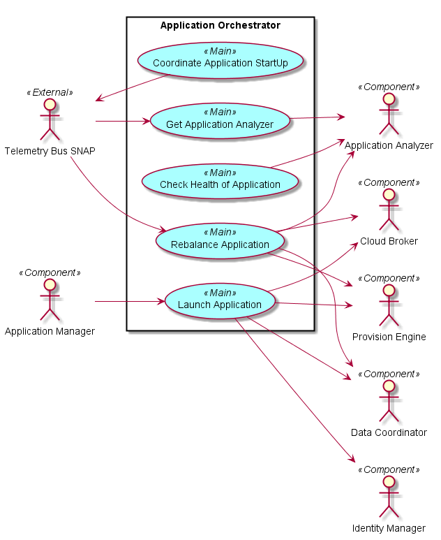
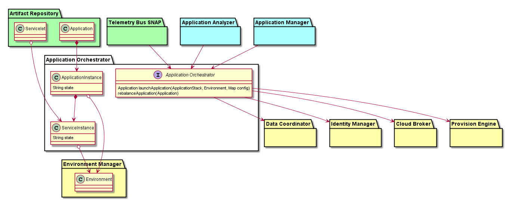

# Application Orchestrator
Application Orchestrator is responsible for taking the Application Stack 
definition and coordinating the provisioning of resources in the Cloud
through the Cloud Broker. And then installing and configuring software 
stacks on the resources in a coordinated manner.

## Use Cases

## Actors
### Users 
* [Cloud Broker](../CloudBroker/README.md)
* [Provision Engine](../ProvisionEngine/README.md)
* [Data Coordinator](../DataCoordinator/README.md)
* [Identity Manager](../IdentityManager/README.md)
* Telemetry Bus SNAP
* [Application Manager](../ApplicationManager/README.md)
* [Application Analyzer](../ApplicationAnalyzer/README.md)

### Uses

* [Launch Application](../ApplicationManager/LaunchApplication/README.md)
* [Rebalance Application]
* [Get Application Analyzer]
* [Check Health of Application]
* [Coordinate Application StartUp]

## Interface
* Rest API

## Artifacts
* ApplicationInstance
* ServiceInstance

## Services
*
