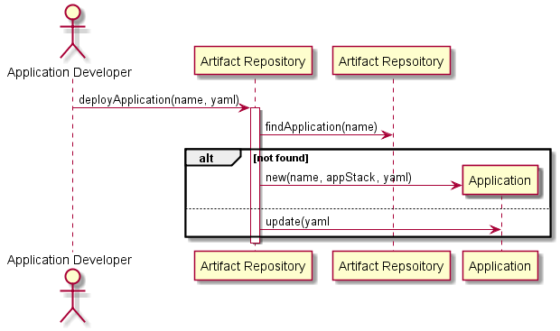

# Deploy Application Scenario

## Interactions
Application Developer interacts with the Artifact Repository to deploy and application
that other people can then use in the cloud. The Application can take a configuration
file if needed.

### Users

* [Application Developer](../../Actors/ApplicationDeveloper/README.md) - See command line [examples](../../Actors/ApplicationDeveloper/README.md#deploy-application)

### Systems

* [Artifact Repository](../../ArtifactRepository/README.md)

