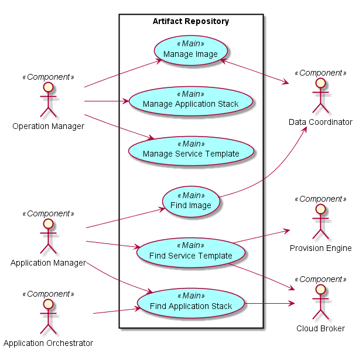
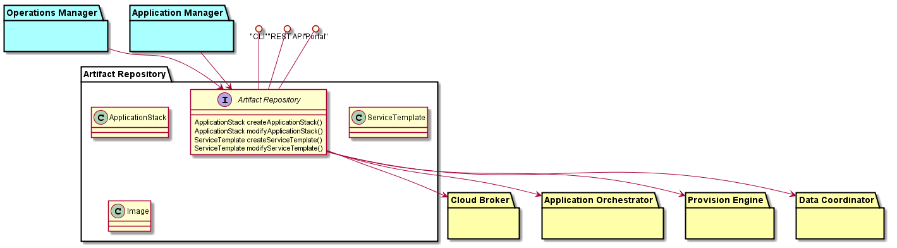
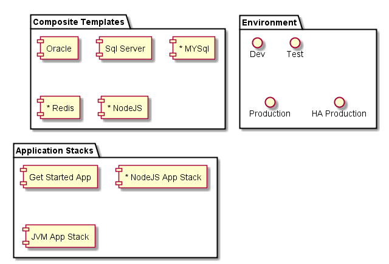

# Artifact Repository
Artifact repository has all of the artifacts for CAADE. 
These artifacts include ApplicationStacks, ServiceStacks, and Environments.

## Use Cases
* [Deploy Application](#deploy-application)
* Remove Application
* Manage Application Stack
* Manage Image
* Manage Service Template
* Find Image
* Find Application
* Find Application Stack
* Find Service Template

 

## Actors
### Users 
 * Application Orchestrator
 * Operation Manager
 * Application Manager

### Uses
* Cloud Broker
* Provision Engine
* Data Coordinator

## Interface
* CLI
* Rest-API
* Portal

## Artifacts
* ApplicationStack - This contains the definition of the application stack that an application can run in. It contains ApplicationStacklets for each environment.
* ApplicationStacklet- ApplicationStack for a specific Environment. It contains Servicelets.
* Service - This is a High level abstraction that represents a service (simple and Complex) that is offered in the Cloud in environments. It has a ServiceTemplate for each environment it can run in.
* Servicelet - This is an a Service for a specific Environment in the context of a ApplicationStacklet.
 It is the combination of the ApplicationStacklet, Environment, and Service Definitions.
* ServiceTemplate - This is the definition of a Service that is running in the Cloud. It contains resource requirements, run scripts (Provision, Decommission, upgrade),  - This is the definition of a Service that is running in the Cloud. It contains resource requirements, run scripts (Provision, Decommission, upgrade) for a specific environment.
* RunScript - This is the a script that is run when an event occurs in the system. This can be used for provisioning services, decommissioning services, upgrades etc...
* Image - This is a container, VM, or ISO (BAre metal) image that the service will use when provisioning.

## Services
* 

