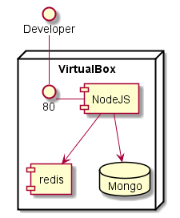
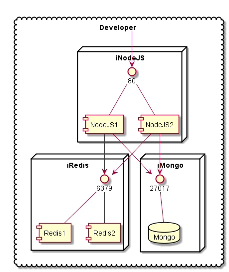
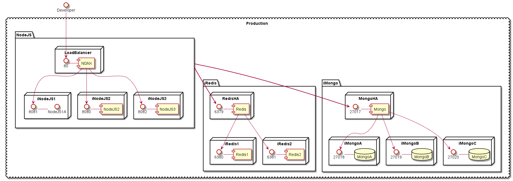

# Examples of Multiple Environments
This is shows a simple Node JS application stack that has four different environment configurations.
Local, Development, Test, and Production

## Local

Simple environment running on Virtual Box exposing port 80 to the Developer. It has NodeJS, Redis and MongoDB services

## Development

This is running in the cloud and now the developer can access the application through port 80.
There are 2 NodeJS services, 2 Redis Services and a MongoDB service. The ports are exposed inside the 
security domain esablished when the application stack is deployed.

## Test

This is running in a cloud that is targeted for testing. There could be additional policies for the environment
that make it easy to debug and analyze performance and logs. This has a NGNX service for loadbalancing, Two NodeJS nodes,
Two Redis Services and a Mongo DB service. The main port exposed is port 80. The other ports are in the security domain.
The Developer should be able to run commands to get more information from the machines running the services.

## Production

This is running in a cloud that is targeted for Production. There are additional policies in the environment to make 
all of the applications and services production ready including backup, DR, HA, etc...
The services are protected by a Micro-segmented Security Domain.

