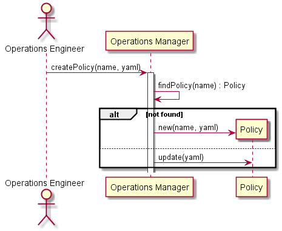

# Create Policy Scenario

## Interactions
[Operations Manager](../../Actors/OperationsManager/README.md) interacts with the Operations Manager to create Policies.
This can be created via a web interface, or a yaml representation of the application stack.

### Users

* [Operations Manager](../../Actors/OperationsManager/README.md) - See command line [examples](../../Actors/OperationsManager/README.md#create-policy)

### Systems

* [Operations Manager](../../OperationsManager/README.md)
