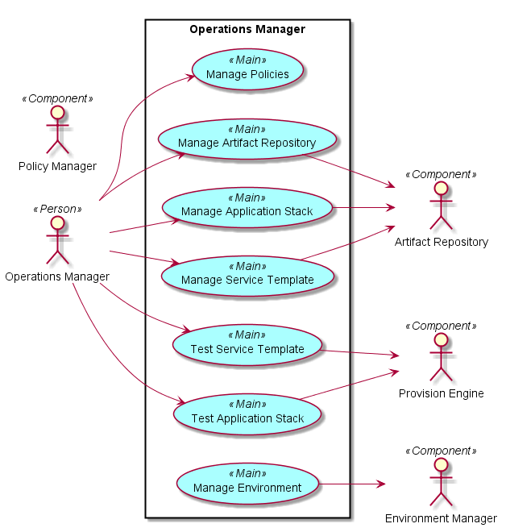
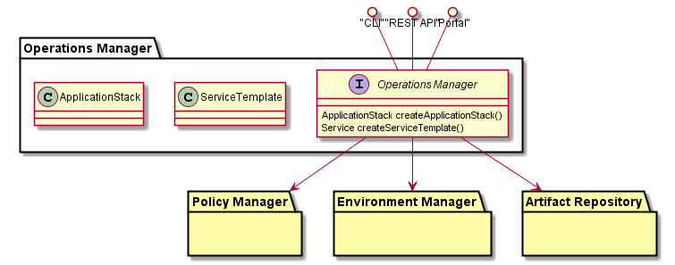

# Operations Manager
Operations Manager is responsible for giving the operator the ability to create 
Service Templates, Application Stacks, Evnrionments and policies reguarding those elements. 
This is the main interface for the CAADE Operator.

## Use Cases
* Create Environment
* Create Application Stack
* Create Service Template
* Modify Service Template
* Modify Application Stack
* Test Service Template
* Test Application Stack
* Manage Artifact Repository
* Manage Policies for Environment
* Manage Policies for Application Stack
* Modify Environment

 

## Actors
Users 
* Operations Engineer

Uses
* Policy Manager
* Environment Manager
* Provision Engine
* Artifact Repository

## Interface
* CLI
* REST-API
* Portal

## Artifacts
* 
* 

## Services
*

