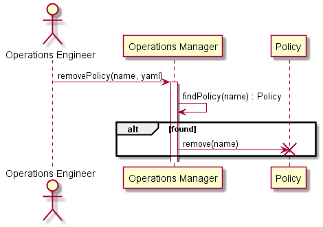

# Remove Policy Scenario

## Interactions
[Operations Manager](../../Actors/OperationsManager/README.md) interacts with the Operation Manager to remove policies from
the system.

### Users

* [Operations Manager](../../Actors/OperationsManager/README.md) - See command line [examples](../../Actors/OperationManager/README.md#remove-policy)

### Systems

* [Operations Manager](../../OperationsManager/README.md)
