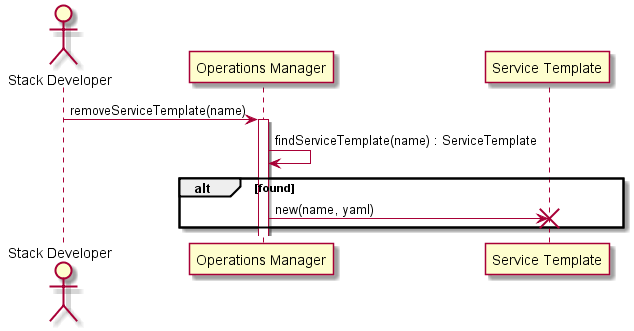

# Remove Service Template Scenario

## Interactions
[Stack Developer](../../Actors/StackDeveloper/README.md) interacts with the Operations Manager to remove a Service Template.

### Users

* [Stack Developer](../../Actors/StackDeveloper/README.md) - See command line [examples](../../Actors/StackDeveloper/README.md#remove-service-template)

### Systems

* [Operations Manager](../../OperationsManager/README.md)
