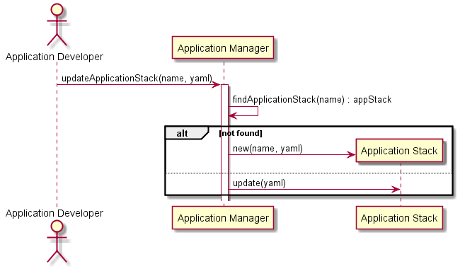

# Update Application Stack Scenario

## Interactions
[Stack Developer](../../Actors/StackDeveloper/README.md) interacts with the Application Manager to update an Application Stack.
This can be created via a web interface, or a yaml representation of the application stack.

### Users

* [Stack Developer](../../Actors/StackDeveloper/README.md) - See command line [examples](../../Actors/StackDeveloper/README.md#update-application-stack)

### Systems

* [Application Manager](../../ApplicationManager/README.md)
