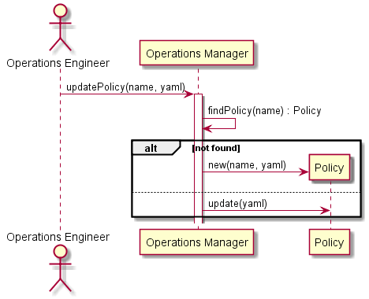

# Update Policy Scenario

## Interactions
[Operations Manager](../../Actors/OperationsManager/README.md) interacts with the Operations Manager
to update the Policy. This can be done via a web interface, or a yaml representation of the Policy.

### Users

* [Operations Manager](../../Actors/OperationsManager/README.md) - See command line [examples](../../Actors/OperationsManager/README.md#remove-policy)

### Systems

* [Operations Manager](../../OperatonsManager/README.md)

