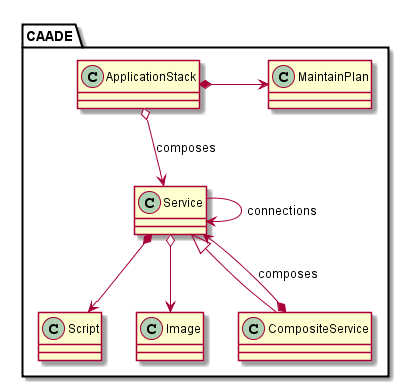
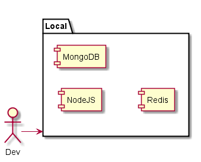
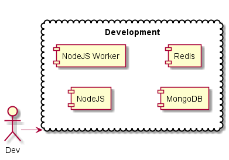
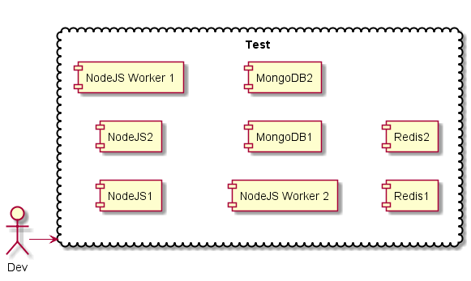
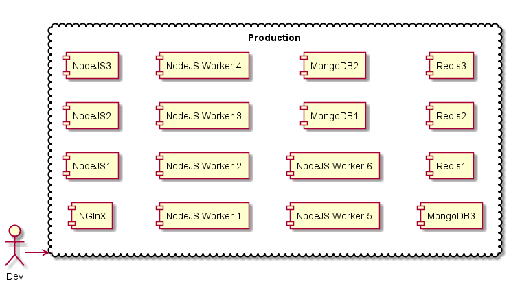
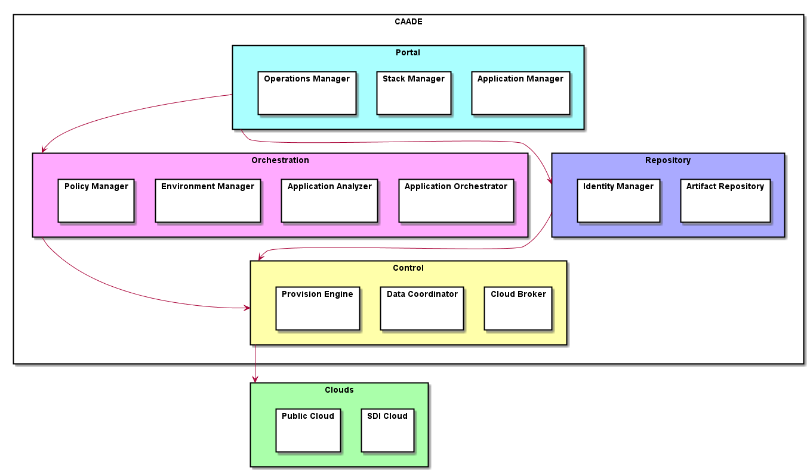
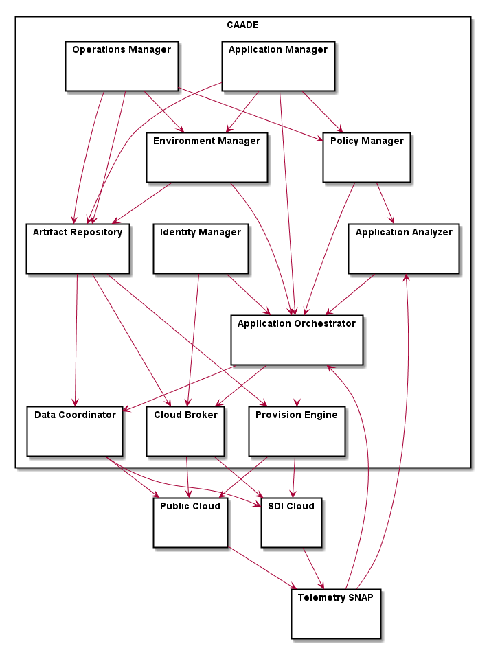

# CAADE Architectural Overview
Cloud Aware Application Development Ecosystem is a reference architecture that 
targets application developers that develop in the cloud. This reference architecture shows the use cases,
and specs for implementing the CAADE Architecture. The architecture is broken up into several different
components and sections.

## Users
 * [Application Developer](Actors/ApplicationDeveloper/README.md)
 * [Stack Developer](Actors/OperationsManager/README.md)
 * [Operations Engineer](Actors/StackDeveloper/README.md)

## High level Use Cases
* Create Application - from application stack.
* Run Application - on multiple environments, includes debug and execute
* Deploy Application - on multiple environments (Production, Test, etc...)
* Manage Application Stack - includes creation, modification and version control for multiple environments.
* Manage Service Template - includes creation, modification and version control.
* Test Application Stack - make sure the application stack is good in all environments
* Manage Infrastructure - connectivity to multiple clouds and single pane of glass for management.
* Create Policies - for Infrastructure and Applications running in the system
* Create Environments - applications run in different environments including: Production, Test, Dev, etc...

## High Level Concepts

* Application Stack - contains a reference to services that are required to make an Application. There can be different 
configurations based on Environments
* Service -  represents a service running in different environments. Example: A MongoDB service could be a simple 
instance or a HA solution based on the environment it is running in.
* Composite Service - represents an aggregation of services that are managed together. There can be multiple 
configurations of composite services basd on environments.
* Script - a script that is run based on events that are happening in the System. Examples. Start, Stop, Deploy, upgrade.
* Image - a standard image that can be deployed to any number of clouds or environments.
* Envronment - A group of resources with policy that applications and services execute. Each Environment has unique 
policies that govern the services and applications in the environment.

### Environments and Applications
Application Stacks and Services can have a definition for individual environments. This allows
Application Developers to deploy applications to multiple environments.  In this example a simple 
NodeJS Application Stack can be deployed into four different environments with different service
topologies

#### Local Environment 

Only 3 containers or VMs are running this application in a VirtualBox
on the local machine.

#### Development Environment 

Now the Application is running in the Cloud and we have introduced a
Working Node to handle some additional load and allow for scalability testing.

#### Test Environment

Now the developer wants to test his code on an environment that has more debugging tools and
enough services to show the scalability and cloud awareness of his application.

#### Production Environment

Production Environment with High Availability Services to make sure we have QoS required by
SLAs that have been agreed to. Additional Services have been added and multiple instances of
primary services are running.

## High Level Architecture
The CAADE Architecture contains several subsystems and components. The following is a diagram on
how these components work together to fulfill the high level use cases.

* [Application Analyzer](ApplicationAnalyzer/README.md) - Deep learning analytics for application optimization
* [Application Manager](ApplicationManager/overivew.md) - Manage Applications (Creation, Launch, Destroy, etc...)
* [Application Orchestrator](ApplicationOrchestrator/overivew.md) - Orchestrate services to serve up an application
* [Artifact Repository](ArtifactRepository/README.md) - Store images, Service Templates, Application Stacks, etc...
* [Cloud Broker](CloudBroker/README.md) - Distribute and manage requests to multiple clouds
* [Data Coordinator](DataCoordinator/README.md) - Coordinate images, and data between clouds
* [Environment Manager](EnvironmentManager/README.md) - Manage Envinronments for the system (Dev, Test, Production, etc...)
* [Identity Manager](IdentityManager/README.md) - Manage identity of the user across multiple clouds
* [Operations Manager](OperationsManager/overivew.md) - Operations Portal for managing Operations and Stack development. 
* [Policy Manager](PolicyManager/README.md) - Manage Policies for execution of services and applications in the system
* [Provision Engine](ProvisionEngine/README.md) - Provision services and application on resources from the cloud
* SDI Cloud - Any Private SDI Cloud including VMWare, OpenStack, Nutantix, Containers, etc...
* Public Cloud - Public Clouds including AWS, IBM Cloud, Google Cloud Engine, etc...
* Telemetry SNAP - Telemety Bus from multiple clouds, services and application stacks.

## Detail Architectural Diagram
This shows the details of the subsystem's interactions

