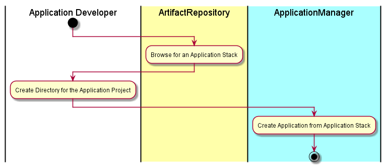

# Create Application
The [Application Developer](../../Actors/ApplicationDeveloper/README.md) interacts with [Artifact Repository](../../ArtifactRepository/README.md)
to find out what application stack they want to use for a new Application. Once they
have selected the application stack they give their application a name. When the Application is created
a representation of the application is "downloaded" into the directory. This allows a developer to run
disconnected from the system. An example of an application definition could be a yaml or json file or set
of files and directories.

# Actors

* [Application Developer](../../Actors/ApplicationDeveloper/README.md)

# Activities

* Browse for an Application Stack to use for the Application
* Create a Directory for the Project
* Create a Application from the Application Stack

# Detail Scenarios
* [Create Application](../../ApplicationManager/CreateApplication/README.md) - See detail information [here](../../Actors/ApplicationDeveloper/README.md#create-application)

