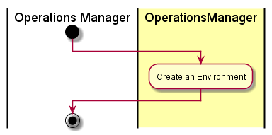

# Create Environment
The [Operation Manager](../../Actors/OperationsManager/README.md) interacts with [OperationsManager](../../OperationsManager/README.md)
to create environments for the cloud. An Evnrionment allows for policies to be created
for each evnrionment.

# Actors

* [Operations Manager](../../Actors/OperationsManager/README.md)

# Activities

* 

# Detail Scenarios

* [Create Environment](../../OperationsManager/README.md)

