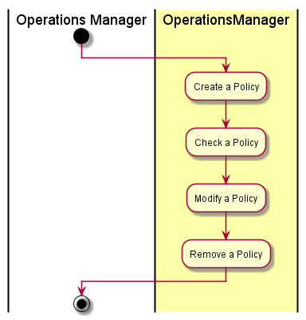

# Create Policies
The [Operations Manager](../../Actors/OperationsManager/README.md) interacts with [Operations Manager](../../OperationsManger/README.md)

# Actors

* [Operations Manager](../../Actors/OperationsManager/README.md)

# Activities

* Create a Polity
* Modify a Policy
* Remove a Policy
* Check Policy

# Detail Scenarios
* [Create Policy]
* [Modify Policy]
* [Remove Policy]
* [Check Policy]

