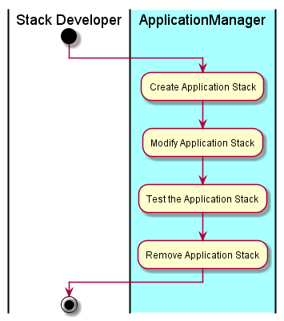

# Manage Application Stack
The [Stack Developer](../../Actors/StackDeveloper/README.md) interacts with the
[Application Manager](../../ApplicationManager/README.md) to create new application stacks,
modify application stacks, and remove application stacks. The application stack is a combination
of services that make up a fully funtional application. Or allow for a fully funtion application
to run on the stack. Examples would be LAMP stack, MEAN stack, etc...

# Actors

* [Stack Developer](../../Actors/StackDeveloper/README.md)

# Activities

* Create an Application Stack
* Modify an Application Stack
* Test the Application Stack
* Remove the Application Stack

# Detail Scenarios

* [Create Application Stack](../../OperationsManager/CreateApplicationStack/README.md)
* [Update Application Stack](../../OperationsManager/UpdateApplicationStack/README.md)

