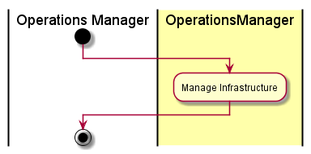

# Manage Infrastructure
The [Operations Manager](../../Actors/OperationsManager/README.md) interacts with [Operations Manager](../../OperationsManager/README.md)
to create, modify and remove infrastructure items (Compute, Storage, Network). This should be
a pass-thru to the SDI layers through the Cloud Broker.

# Actors

* [Operations Manager](../../Actors/OperationsManager/README.md)

# Activities

* Create Compute Service
* Modify Compute Service
* Remove Compute Service
* Create Network Service
* Modify Network Service
* Remove Network Service
* Create Storage Service
* Modify Storage Service
* Remove Storage Service

# Detail Scenarios

* TBD 

