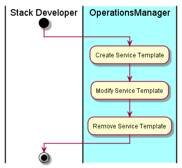

# Manage Service Template
The [Stack Developer](../../Actors/StackDeveloper/README.md) interacts with [Operations Manager](../../OperationsManager/README.md)
to create new Services that can be used in the cloud. This can include individual services
as well as composite services. These services make up an application stack.

# Actors

* [Stack Developer](../../Actors/StackDeveloper/README.md)

# Activities

* Create Service Template
* Modify Service Template
* Remove Service Template

# Detail Scenarios

* [Create Service Template](../../OperationsManager/CreateServiceTemplate/README.md)
* [Modify Service Template](../../OperationsManager/ModifyServiceTemplate/README.md)
* [Remove Service Template](../../OperationsManager/RemoveServiceTemplate/README.md)

