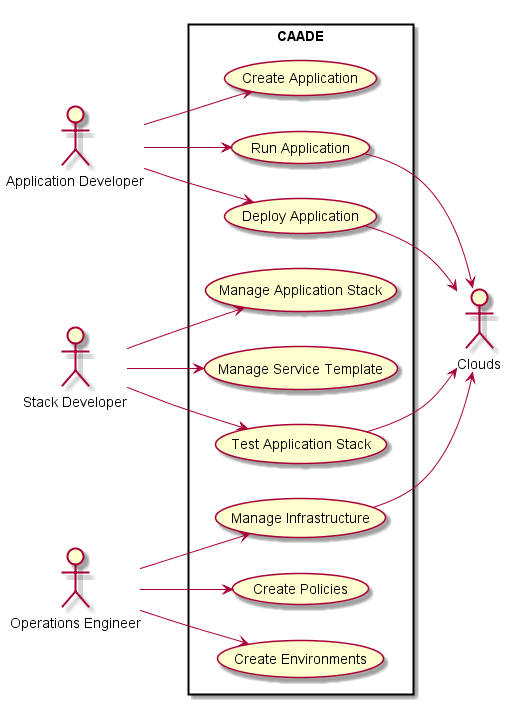

# High Level Use Cases for CAADE

* Create Application - from application stack.
* Run Application - on multiple environments, includes debug and execute
* Deploy Application - on multiple environments (Production, Test, etc...)
* Manage Application Stack - includes creation, modification and version control for multiple environments.
* Manage Service Template - includes creation, modification and version control.
* Test Application Stack - make sure the application stack is good in all environments
* Manage Infrastructure - connectivity to multiple clouds and single pane of glass for management.
* Create Policies - for Infrastructure and Applications running in the system
* Create Environments - applications run in different environments including: Production, Test, Dev, etc...

