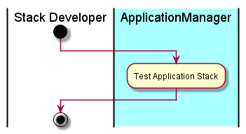

# Create Application
The [Stack Developer](../../Actors/StackDeveloper/README.md) interacts with ...

# Actors

* [Stack Developer](../../Actors/StackDeveloper/README.md)

# Activities

*

# Detail Scenarios

*

