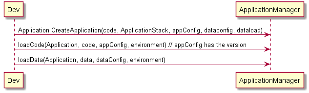

# CAADE Architectural Overview
Cloud Aware Application Development Ecosystem is a reference architecture that 
targets application developers that develop in the cloud. This reference architecture shows the use cases,
and specs for implementing the CAADE Architecture. The architecture is broken up into several different
components and sections.

## Users
 * Application Developer
 * Stack Developer 
 * Operations Engineer

## High level Use Cases

## High Level Architecture

