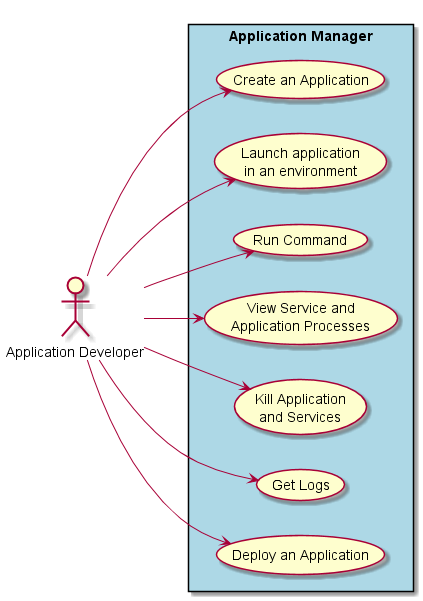
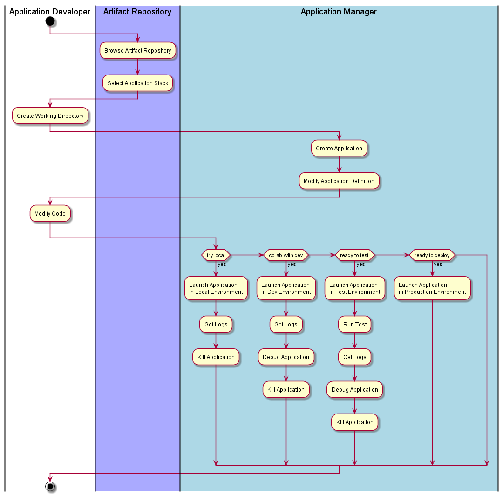
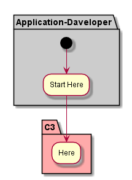

.. _Actor-Application-Developer:
.. _Actor-Developer:

Developer
=========

The Application Developer develops cloud aware applications, and deploys them in the C3 system.

Use Cases
---------

* :ref:`Scenario-Create-Application`
* :ref:`Scenario-Launch-Application`
* :ref:`Scenario-Update-Application`
* :ref:`Scenario-Run-Command`
* :ref:`Scenario-View-Service`
* :ref:`Scenario-Kill-Application`
* :ref:`Scenario-Get-Logs`
* :ref:`Scenario-Deploy-Application`

Typical Workflow
~~~~~~~~~~~~~~~~

Application Developers all work in different ways. This workflow show some possible workflows
for the typical application developer.

Application Developer
=====================

Use Cases
---------

Activities
----------

Workflow
--------

User Interface
--------------

.. image: ApplicationDeveloperWeb.png

Command Line Interface
----------------------

The command line for the :ref:`Actor-Developer` uses the 'c3 app' command. For details
see the scenarios.

.. code:: none

  # c3 app checkhealth [options]  Check the Health of the Application Instance
  # c3 app create [options]       Create Application with stack and name
  # c3 app debug [options]        Debug an application
  # c3 app deploy [options]       Deploy an application
  # c3 app destroy [options]      Destroy(remove) an application
  # c3 app get [options]          Get an Application
  # c3 app kill [options]         Kill an Application
  # c3 app launch [options]       Launch and Application into a environment with a config
  # c3 app list [options]         List applications
  # c3 app publish [options]      Publish an Application
  # c3 app rebalance [options]    Rebalance an Application on an environment
  # c3 app run [options]          Run a command in the context of an application by environment.

