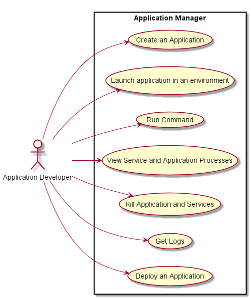
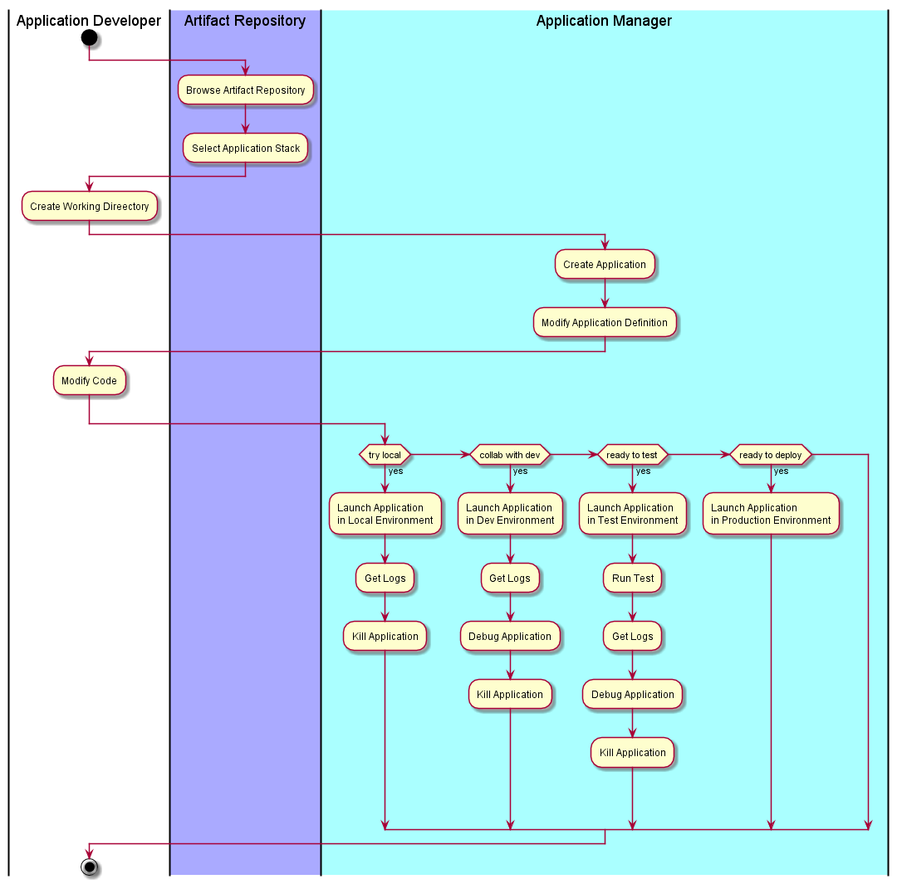

.. _Actor-Developer:
.. _Actor-Application-Developer:

Actor Developer
==================

The Application Developer develops cloud aware applications.

Use Cases
---------

* :ref:`Scenario-CreateApplication`
* :ref:`Scenario-LaunchApplication`
* :ref:`Scenario-UpdateApplication`
* :ref:`Scenario-RunCommand`
* :ref:`Scenario-ViewService`
* :ref:`Scenario-KillApplication`
* :ref:`UseCase-Get-Logs`
* :ref:`Scenario-DeployApplication`

Typical Workflow
~~~~~~~~~~~~~~~~

Application Developers all work in different ways. This workflow show some possible workflows
for the typical application developer.

User Interface
--------------

TBD

Command Line
------------

Examples on how to use C3

:ref:`Scenario-CreateApplication`
~~~~~~~~~~~~~~~~~~~~~~~~~~~~~~~~~

.. code-block:: none

  # C3 app create <Application Name> --stack=<Application Stack>  # creates a new application from selected stack

:ref:`Scenario-GetApplication`
~~~~~~~~~~~~~~~~~~~~~~~~~~~~~~

Allow the developer to attach an existing application to a project.
Great if they want to share an application or re-attach an application to a project.

.. code-block:: none

  # C3 app clone <Application Name> [--version=<Application Version>]

:ref:`Scenario-LaunchApplication`

This command should make sure that the application is up. If the application is already up
then it should just return that it is up. If it is not up yet then it should launch the application.
This behavior should be consistent across all of the environments.

* Launch application in Specified environment

.. code-block:: none

    # C3 up --env=local  # Local machine
    # C3 up              # local Machine
    # C3 up --env=dev    # development environment
    # C3 up --env=prod   # production environment
    # C3 up --env=test   # test environment
    # C3 up --env=<Environment Name>

* Launch service in application in default <local> environment

.. code-block:: none

    # C3 up redis    # Launch the redis service in the application
    # C3 up mongo    # Launch the mongo service in the application
    # C3 up web      # Launch the nodejs web service in the application
    # C3 up worker   # Launch the nodejs worker service in the application
    # C3 up worker --env=test   # Launch the nodejs worker service in the test environment

:ref:`Scenario-UpdateApplication`
~~~~~~~~~~~~~~~~~~~~~~~~~~~~~~~~~

When developers are working they need to update the application with new source code.
This could include any or all of the services in the application. The developer should be able
to update all of the services, one service and any number of services. The source code at the
top level project directory will be pushed out to the all of the services specified. If the service
does not have source code corresponding then it is checked for the latest updates.

* Update application on cloud in the test environment

.. code-block:: none

    # C3 update

* Update web service with new code in the development environment

The source code in the current project directory is propagated to the context (Machine, VM, or container) of the
service and the service is told to update. This could mean restart or just update source.
.. code-block:: none

    # C3 update web # update the default environment <local>
    # C3 update worker
    # C3 update worker --env=test # update the test environment

* Upgrade service with released changes. Example upgrade mongo DB to latest release

.. code-block:: none

    # C3 upgrade mongo    # in the default environment
    # C3 upgrade mongo --env=test   # in the test environment
    # C3 upgrade mongo --version=3.2.0   # upgrade to specific version

The :ref:`Actor-OperationsManager` is responsible for naming and creating environments.

:ref:Scenario-RunCommand
~~~~~~~~~~~~~~~~~~~~~~~~
Running a command might not seem like it makes sense in the case of an application, but there are several times when
a developer will want to test, or control their application while they are developing it. All commands are run in the
same security context and environment as the application is currently running or you can specify. You can also specify
that you want the command executed in the same container or machine as a specific service or process of a service.

* Run command in same environment as application

.. code-block:: none

    # C3 run "echo 'hello world'"

* Run command in specified environment for the application

.. code-block:: none

    # C3 run --env=test "echo 'hello world'"
    # C3 run --env=<Environment Name> "echo 'hello world'"

* Run Command in all containers, VMs, or machines of specific service

This will run echo 'hello world' on every machine that has a redis service running for the application.
.. code-block:: none

    # C3 run --service=redis "echo 'hello world'"

* Run Command in a container, VM, or machine of specific service process

This will run echo 'hello world' on every machine that has a redis service running for the application.
.. code-block:: none

    # C3 run --service=redis.23143 "echo 'hello world'"

:ref:`Scenario-ViewService`
~~~~~~~~~~~~~~~~~~~~~~~~~~~~

* Show processes for application

.. code-block:: none

    # C3 ps
    ID      Name        Command      State
    ======  =========== ============ ==========
    23143   redis       ./redis ...  Running
    23144   redis       ./redis ...  Running
    23145   redis       ./redis ...  Running
    23146   mongo       ./mongo ...  Running
    23147   worker      npm ...      Running
    23148   worker      npm ...      Exit 0
    23149   worker      npm ...      Starting

:ref:`Scenario-KillApplication`

* Kill all services on for the application

.. code-block:: none

    # C3 kill

* Kill specific service for the application

.. code-block:: none

    # C3 kill <Service_Name>
    # C3 kill redis # kill redis - all processes running service
    # C3 kill redis.23412 # kill redis - only the process with the process id.
    # C3 kill 23412 # kill only the process with the process id.

:ref:`Scenario-GetLogs`
~~~~~~~~~~~~~~~~~~~~~~~

* Get logs of the application

.. code-block:: none

    # C3 logs

* Get logs of specific service

.. code-block:: none

    # C3 logs redis

* Get logs of specific process for the service

.. code-block:: none

    # C3 logs redis.23412

* Get specific log from machines that service processes are running

.. code-block:: none

    # C3 logs redis --log=/var/syslog

* Get specific log from machine that service is running

.. code-block:: none

    # C3 logs redis.223412 --log=/var/syslog

:ref:`Scenario-DeployApplication`
~~~~~~~~~~~~~~~~~~~~~~~~~~~~~~~~~

* Deploy an application

.. code-block:: none

    # C3 deploy    # deploy application on server
    # C3 publish   # publish application for a general access
