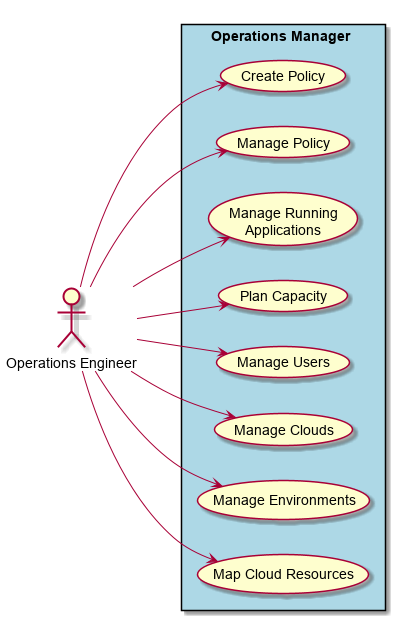
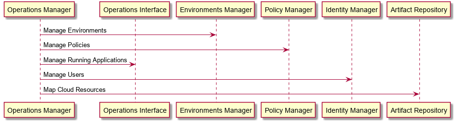

.. _Actor-Operations-Manager:

Operations Manager
==================

The Operation Manager is responsible for managing the operations of the system.
This includes the creation and management of environments, users, and connectivity to the Clouds.

Use Cases
---------

* :ref:`UseCase-Manage-Environments`
* :ref:`UseCase-Manage-Policies`
* :ref:`UseCase-Manage-Applications`
* :ref:`UseCase-Manage-Infrastructure`
* :ref:`UseCase-Manage-Users`
* :ref:`UseCase-Manage-Clouds`

Typical Workflow
~~~~~~~~~~~~~~~~

.. image:: Workflow.png

Use Cases
---------

Activities
----------

Workflow
--------

.. image:: Workflow.png

User Interface
--------------

Command Line Interface
----------------------

c3 command line interface for the :ref:`Actor-Operations-Manager`

**Manage Environments**

.. code-block:: none

    # c3 env create [options]   Create Environment
    # c3 env destroy [options]  Destroy an Environment
    # c3 env get [options]      Get details about an Environment
    # c3 env list [options]     List Environments
    # c3 env update [options]   Update Environment

**Manage Policies**

.. code-block:: none

    # c3 policy check [options]    Check policy
    # c3 policy create [options]   Create a policy for a cloud, environment, or globally
    # c3 policy destroy [options]  Destroy policy
    # c3 policy disable [options]  Disable Policy
    # c3 policy enable [options]   Enable Policy
    # c3 policy list [options]     List Policies
    # c3 policy update [options]   Update Policy

**Manage Applications**

.. code-block:: none

  # c3 app checkhealth [options]  Check the Health of the Application Instance
  # c3 app create [options]       Create Application with stack and name
  # c3 app debug [options]        Debug an application
  # c3 app deploy [options]       Deploy an application
  # c3 app destroy [options]      Destroy(remove) an application
  # c3 app get [options]          Get an Application
  # c3 app kill [options]         Kill an Application
  # c3 app launch [options]       Launch and Application into a environment with a config
  # c3 app list [options]         List applications
  # c3 app publish [options]      Publish an Application
  # c3 app rebalance [options]    Rebalance an Application on an environment
  # c3 app run [options]          Run a command in the context of an application by environment.

**Manage Infrastructure**

.. code-block:: none

    # c3 cloud create [options]       Create Cloud
    # c3 cloud destroy [options]      Destroy Cloud
    # c3 cloud list [options]         List Clouds
    # c3 cloud update [options]       Update Cloud
    # c3 hardware capacity [options]  Capacity Planning of hardware
    # c3 hardware create [options]    Create Hardware
    # c3 hardware destroy [options]   Destroy Hardware
    # c3 hardware list [options]      List Hardware
    # c3 hardware populate [options]  Populate Hardware to a Cloud (Multi Create)
    # c3 hardware update [options]    Update Hardware

**Manage Users**

.. code-block:: none

    # c3 user create [options]   Create User
    # c3 user destroy [options]  Destroy User
    # c3 user list [options]     List Users
    # c3 user update [options]   Update User

**Manage Cloud**

.. code-block:: none

    # c3 cloud create [options]       Create Cloud
    # c3 cloud destroy [options]      Destroy Cloud
    # c3 cloud list [options]         List Clouds
    # c3 cloud update [options]       Update Cloud
