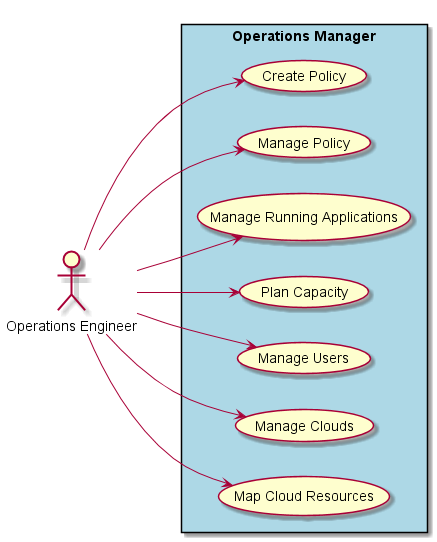
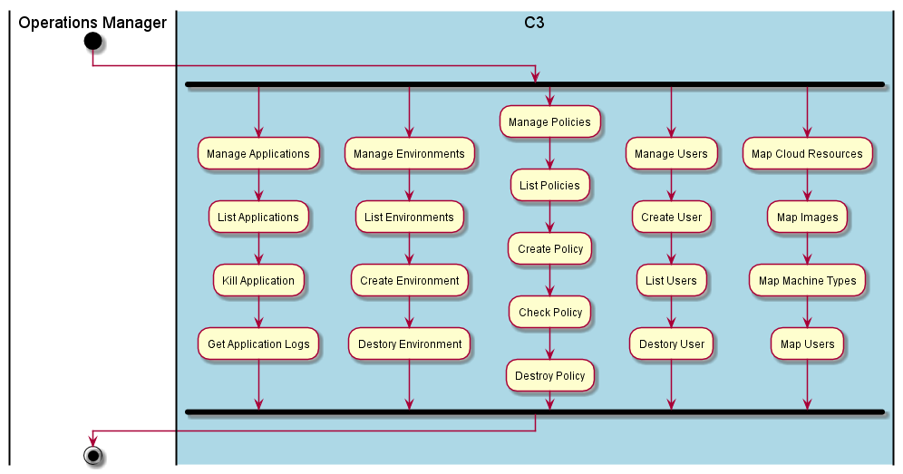
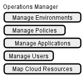

.. _Actor-Operations-Manager:

Actor Operations Manager
========================
The Operation Manager is responsible for managing the operations of the system.
This includes the creation and management of environments, users, and connectivity to the Clouds.

Use Cases
---------

* :ref:`UseCase-Manage-Environment`
* :ref:`UseCase-Manage-Policies`
* :ref:`UseCase-Manage-Applications`
* :ref:`UseCase-Manage-Infrastructure`
* :ref:`UseCase-Manage-Users`
* :ref:`UseCase-Manage-Clouds`

Typical Workflow
~~~~~~~~~~~~~~~~

User Interface
--------------

Command Line
------------

Examples on how to use C3 for the Operations Manager

.. code-block:: none

    # C3 environment create <environmentName> --file <filenamee>

:ref:`Scenario-Update-Environment`
~~~~~~~~~~~~~~~~~~~~~~~~~~~~~~~~~~

Update an Environment with the specification in the filename.

.. code-block:: none

    # C3 environment update <environmentName> --file <filenamee>

:ref:`Scenario-Delete-Environment`
~~~~~~~~~~~~~~~~~~~~~~~~~~~~~~~~~~

Delete an Environment

.. code-block:: none

    # C3 environment delete <environmentName>

:ref:`Scenario-List-Environments`
~~~~~~~~~~~~~~~~~~~~~~~~~~~~~~~~~

List all of the environments and basic information about the environments.

.. code-block:: none

    # C3 environment ls
    Name          Applications   Running
    ============  ============== =======
    Development    12              2
    Test           12              4
    Production     8               6

:ref:`Scenario-Show-Environment-Processes`
~~~~~~~~~~~~~~~~~~~~~~~~~~~~~~~~~~~~~~~~~~

.. code-block:: none

    # C3 environment ps <environmentName>
    ID      Name        Command      State
    ======  =========== ============ ==========
    23143   redis       ./redis ...  Running
    23144   redis       ./redis ...  Running
    23145   redis       ./redis ...  Running
    23146   mongo       ./mongo ...  Running
    23147   worker      npm ...      Running
    23148   worker      npm ...      Exit 0
    23149   worker      npm ...      Starting

:ref:`Scenario-Show-Environment`
~~~~~~~~~~~~~~~~~~~~~~~~~~~~~~~~

Show details about the environment given by the name environmentName

.. code-block:: none

    # C3 envoronment show <environmentName>

:ref:`UseCase-Manage-Policies`
------------------------------

:ref:`Scenario-Create-Policy`
~~~~~~~~~~~~~~~~~~~~~~~~~~~~~

TBD

:ref:`Scenario-List-Policies`
~~~~~~~~~~~~~~~~~~~~~~~~~~~~~

TBD

:ref:`Scenario-Update-Policy`
~~~~~~~~~~~~~~~~~~~~~~~~~~~~~

TBD

:ref:`Scenario-Delete-Policy`
~~~~~~~~~~~~~~~~~~~~~~~~~~~~~

TBD

:ref:`Scenario-Enable-Policy`
~~~~~~~~~~~~~~~~~~~~~~~~~~~~~~~

TBD

:ref:`Scenario-Disable-Policy`
~~~~~~~~~~~~~~~~~~~~~~~~~~~~~~~~~

TBD

:ref:`UseCase-Manage-Applications`
----------------------------------

:ref:`Scenario-List-Applications`
~~~~~~~~~~~~~~~~~~~~~~~~~~~~~~~~

TBD

:ref:`Scenario-Kill-Application`
~~~~~~~~~~~~~~~~~~~~~~~~~~~~~~~~

TBD

:ref:`UseCase-Manage-Users`
---------------------------

:ref:`Scenario-Add-User`
~~~~~~~~~~~~~~~~~~~~~~~~

TBD

:ref:`Scenario-Modify-User`
~~~~~~~~~~~~~~~~~~~~~~~~~~~

TBD

:ref:`Scenario-Remove-User`
~~~~~~~~~~~~~~~~~~~~~~~~~~~

TBD

:ref:`Scenario-List-Users`
~~~~~~~~~~~~~~~~~~~~~~~~~

TBD

:ref:`UseCase-Manage-Clouds`
----------------------------

:ref:`Scenario-Add-Cloud`
~~~~~~~~~~~~~~~~~~~~~~~~~

TBD

:ref:`Scenario-Remove-Cloud`
~~~~~~~~~~~~~~~~~~~~~~~~~~~~

TBD

:ref:`Scenario-List-Clouds`
~~~~~~~~~~~~~~~~~~~~~~~~~~~

TBD

:ref:`Scenario-Show-Cloud`
~~~~~~~~~~~~~~~~~~~~~~~~~~

TBD

:ref:`Scenario-Map-Resources`
~~~~~~~~~~~~~~~~~~~~~~~~~~~~~~~~~~~

TBD

:ref:`Scenario-Map-Images`
~~~~~~~~~~~~~~~~~~~~~~~~~~

TBD

:ref:`Scenario-Map-Machine-Types`
~~~~~~~~~~~~~~~~~~~~~~~~~~~~~~~~~

TBD

:ref:`Scenario-Map-Resources`
~~~~~~~~~~~~~~~~~~~~~~~~~~~~~

TBD

:ref:`UseCase-Manage-Infrastructure`
------------------------------------

:ref:`Scenario-Plan-Capacity`
~~~~~~~~~~~~~~~~~~~~~~~~~~~~~

TBD

