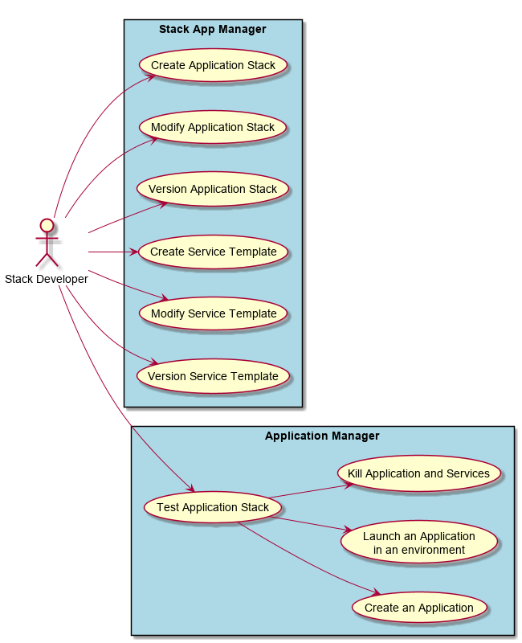
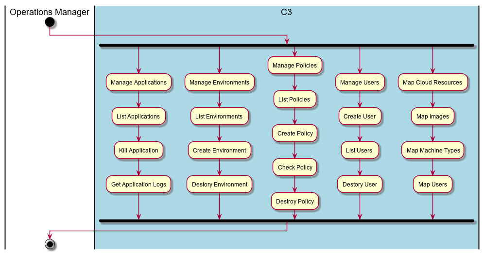
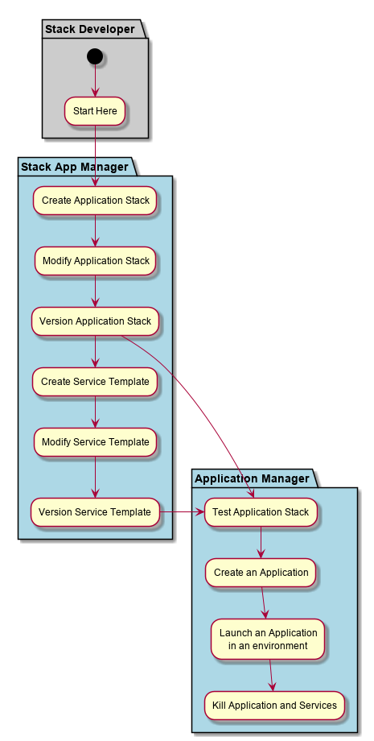

.. _Actor-Stack-Developer:

Stack Developer
===============
The Stack Developer is responsible for developing Application Stack and Service Templates

Use Cases
---------

* :ref:`Scenario-Create-Application-Stack`
* :ref:`Scenario-Update-Application-Stack`
* :ref:`Scenario-Create-Service-Template`
* :ref:`Scenario-Launch-And-Test-Service-Template`
* :ref:`Scenario-Update-Service-Template`
* :ref:`Scenario-Publish-Service-Template`
* :ref:`Scenario-Create-Service-Template`
* :ref:`Scenario-Test-Service`
* :ref:`Scenario-Update-Service`
* :ref:`Scenario-Publish-Service`
* :ref:`Scenario-List-Service`
* :ref:`Scenario-Get-Service`

Primary Workflow
----------------

This represents a typical workflow of the stack developer. Not all steps in the workflow need
to be taken in order. This just represents a typical workflow.

Use Cases
---------

Activities
----------

Workflow
--------

User Interface
--------------

Mock Up User Interface for the Application Developer.

TBD

Command Line Interface
----------------------

c3 Command line interface for the template, stack and application commands.

**Template Command**

.. code-block:: none

    # c3 template create [options]   Create Template
    # c3 template destroy [options]  Destroy Template
    # c3 template disable [options]  Disable Template
    # c3 template enable [options]   Enable Template
    # c3 template get [options]      Get Template
    # c3 template publish [options]  Publish Template
    # c3 template test [options]     Test Template
    # c3 template update [options]   Update Template

**Stack command**

.. code-block:: none

    # c3 stack create [options]   Create Stack
    # c3 stack debug [options]    Debug Stack
    # c3 stack destroy [options]  Destroy Stack
    # c3 stack list [options]     List Stacks
    # c3 stack publish [options]  Publish Stack
    # c3 stack update [options]   Update Stack

