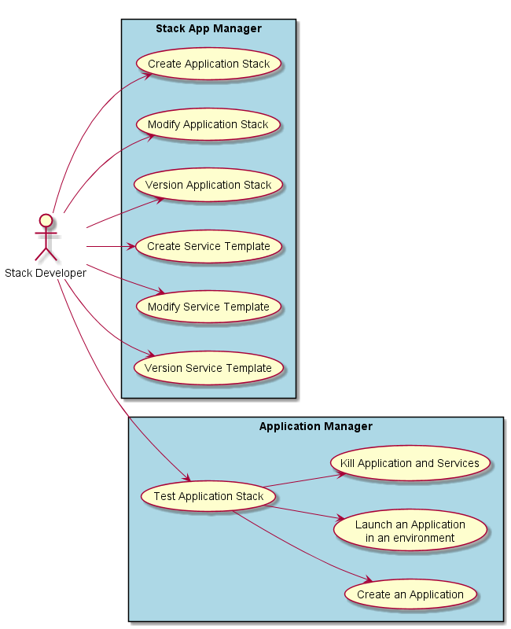
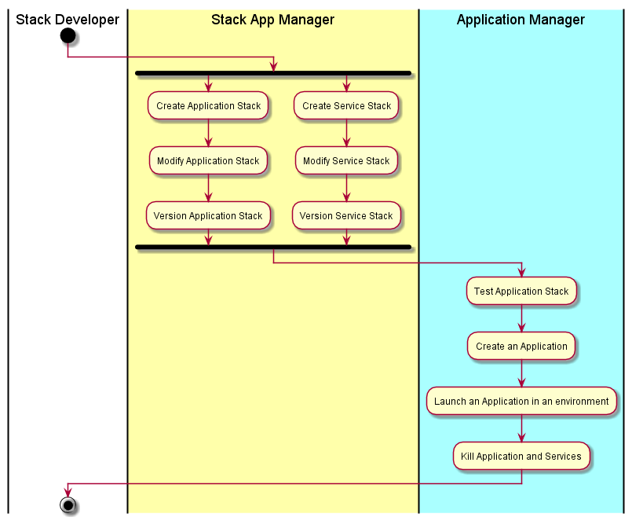

.. _Actor-StackDeveloper:

Actor Stack Developer
=====================
The Stack Developer is responsible for developing Application Stack and Service Templates

Use Cases
---------

* :ref:`Scenario-Create-Application-Stack`
* :ref:`Scenario-Modify-Application-Stack`
* :ref:`Scenario-Version-Application-Stack`
* :ref:`Scenario-Create-Service-Template`
* :ref:`Scenario-Launch-And-Test-Service-Template`
* :ref:`Scenario-Modify-Service-Template`
* :ref:`Scenario-Publish-Service-Template`
* :ref:`Scenario-Create-Service-Template`
* :ref:`Scenario-Launch-And-Test-Stack-Template`
* :ref:`Scenario-Update-Stack-Template`
* :ref:`Scenario-Publish-Stack-Template`
* :ref:`Scenario-List-Stack-Template`
* :ref:`Scenario-Show-Stack-Template`

Primary Workflow
----------------

This represents a typical workflow of the stack developer. Not all steps in the workflow need
to be taken in order. This just represents a typical workflow.

User Interface
--------------

TBD

Command Line
------------
Examples on how to use C3 for the Stack Developer

:ref:`Scenario-Create-Service-Template`

Usually Service Template is a combination of manifests, scripts and media files.
On a file system it can be represented as a project folder.

.. code-block:: none

    # C3 service-template create --name=MongoDb                     # creates new service template with specified name from the base skeleton
    # C3 service-template clone --name=MongoDb [--version=3.2.0]    # downloads existed service template from a server

Example of service template structure:
.. code-block:: none

    |--my-service-template/       # root project folder
       |--media/                  # folder with media files
            |--my-script.sh
            |--my-configuration.json
            |--my-media-folder/
                |--my-distributive.rpm
       |--orchestration/                 # folder with an orchestration scripts for possible events
            |--install-execute-setup-my-service.sh
            # or
            |--install/                                # name of an event
                |--execute/                            # phase name
                    |--setup-my-service.sh             # script name
                |--post-execute/
                    |--validate-service.sh
                |--pre-process-dependencies/
                    |--validate-dependencies.sh
                |--process-dependencies/
                    |--configure-dependencies.sh
       |--environments/             # folder with environment profiles
            |--dev.yaml
            |--testing.yaml
            |--prod.yaml
    |--service.yaml                # service template manifest file

:ref:`Scenario-Modify-Service-Template`
.. code-block:: none

    # C3 service-template push   # push changes made locally to server
    # C3 service-template pull   # pull changes from server
    # C3 service-template set-version 1.7.0.RC1   # update service version

:ref:`Scenario-Launch-And-Test-Service-Template`
~~~~~~~~~~~~~~~~~~~~~~~~~~~~~~~~~~~~~~~~~~~~~~~~
.. code-block:: none

    # C3 service up [--env=<Environment Profile>]      # provision new environment from service template
    # C3 service update [--env=<Environment>]          # update service in environment
    # C3 service kill [--env=<Environment>]            # delete service from environment
    # C3 service run --event=<Event> [--env=<Environment>]  # run specified event
    # C3 service run --commmand="echo 'hello world'" [--env=<Environment>]  # run specified shell command

:ref:`Scenario-Publish-Service-Template`
~~~~~~~~~~~~~~~~~~~~~~~~~~~~~~~~~~~~~~~~
.. code-block:: none

    # C3 service-template publish   # publish service template for a general access

:ref:`Scenario-Create-Stack-Template`
~~~~~~~~~~~~~~~~~~~~~~~~~~~~~~~~~~~~~
Create a stack template.
.. code-block:: none

    # C3 stack-template create --name=3-Tier-App                   # creates new stack template with specified name from the base skeleton
    # C3 stack-template clone --name=3-Tier-App [--version=1.0.0]  # downloads existed stack template from server

Example of stack template structure:
.. code-block:: none

    |--my-stack-template/
        |--service-A/
            |--service.yaml                    # contains manifest of child service A with reference on service template
        |--service-B/
            |--media/
                |--custom-media-script.sh      # custom script for service B
            |--orchestrations/
                |--install
                    |--execute/
                        |--customize-my-service.sh  # custom orchestration script for service B
            |--service.yaml                     # contains manifest of child service B
        |--environments/                        # folder with environment profiles
            |--local.yaml
            |--dev.yaml
            |--testing.yaml
            |--prod.yaml
    |--stack.yaml                              # stack template manifest file

:ref:`Scenario-Modify-Stack-Template`
~~~~~~~~~~~~~~~~~~~~~~~~~~~~~~~~~~~~~
Modify a stack.
.. code-block:: none

    # C3 stack-template push   # push changes made locally to server
    # C3 stack-template pull   # pull changes from server
    # C3 stack-template set-version 1.1.0.RC   # update stack version

:ref:`Scenario-Launch-And-Test-Stack-Template`
~~~~~~~~~~~~~~~~~~~~~~~~~~~~~~~~~~~~~~~~~~~~~~
.. code-block:: none

    # C3 stack up [--env=<Environment Profile>]      # provision new environment from stack
    # C3 stack update [--env=<Environment>]          # update all stack services in environment
    # C3 stack delete [--env=<Environment>]          # delete all stack services in environment

:ref:`Scenario-Publish-Stack-Template`
~~~~~~~~~~~~~~~~~~~~~~~~~~~~~~~~~~~~~~
.. code-block:: none

    # C3 stack-template publish   # publish stack template for general access

:ref:`Scenario-List-Stack-Templates`
~~~~~~~~~~~~~~~~~~~~~~~~~~~~~~~~~~~~
List available stack templates or service templates.
.. code-block:: none

    # C3 stack-template ls
    # C3 stack-template ls <regex>
    # C3 service-template ls
    # C3 service-template ls <regex>

:ref:`Scenario-Show-Stack-Template`
~~~~~~~~~~~~~~~~~~~~~~~~~~~~~~~~~~~
Show details about stack template or service template for the specified environment.
.. code-block:: none

    # C3 stack-template show --name=<Stack Template Name>
    # C3 stack-template show --name=<Stack Template Name> [--version=<Version>] [--env=<Environment>]

    # C3 service-template show --name=<Service Template Name>
    # C3 service-template show --name=<Service Template Name> [--version=<Version>] [--env=<Environment>]

