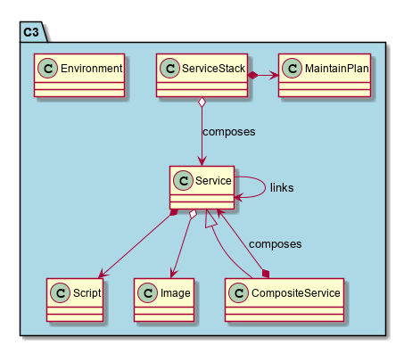
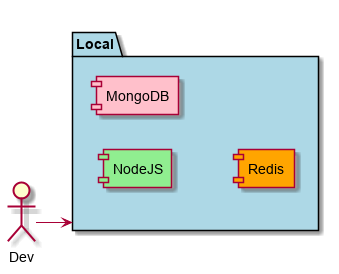
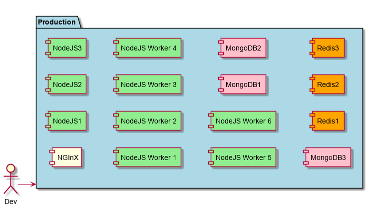
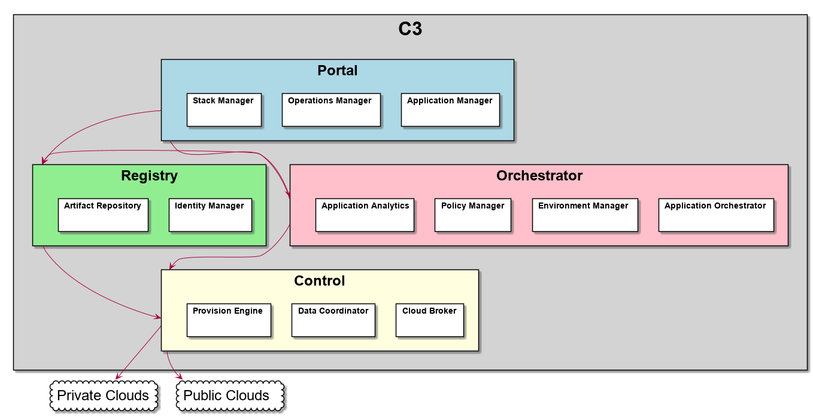

.. _Home:

C3 Overview
===========

The Common Cloud Core is a reference architecture that targets IT and Software Developers that want to develop, test and deploy application ina Multi-Hybrid Cloud system.
This reference architecture shows the use cases, and specs for implementing the CCC Architecture. The architecture is
broken up into several different components and sections.
An introductory video that gives a brief overview of `Common Cloud Core <https://youtu.be/0s_tC5ZEWM4>`_.

.. toctree::
   :maxdepth: 1
   :glob:
   :caption: High Level Use Cases

   **/UseCase*

.. image:: /UseCases/UseCases.png

Users
-----

.. toctree::
    :maxdepth: 1
    :glob:

     /**/Actor*

High Level Concepts
-------------------

* **Application Stack** - contains a reference to services that are required to make an Application. There can be different configurations based on Environments
* **Service** -  represents a service running in different environments. Example: A MongoDB service could be a simple instance or a HA solution based on the environment it is running in.
* **Composite** Service - represents an aggregation of services that are managed together. There can be multiple configurations of composite services basd on environments.
* **Script** - a script that is run based on events that are happening in the System. Examples. Start, Stop, Deploy, upgrade.
* **Image** - a standard image that can be deployed to any number of clouds or environments.
* **Environment** - A group of resources with policy that applications and services execute. Each Environment has unique policies that govern the services and applications in the environment.

Environments and Applications
-----------------------------

Service Stacks and Services can have a definition for individual environments. This allows
:ref:`Actor-Application-Developer`s to deploy applications to multiple environments.  In this example a simple
NodeJS Application Stack can be deployed into four different environments with different service
topologies. Please look at Example for more [detailed examples](Examples) of a NodeJS application running in
multiple Environments.

Local Environment
~~~~~~~~~~~~~~~~~

Only 3 containers or VMs are running this application in a VirtualBox
on the local machine.

Development Environment
~~~~~~~~~~~~~~~~~~~~~~~

Now the Application is running in the Cloud and we have introduced a
Working Node to handle some additional load and allow for scalability testing.

.. image:: ApplicationsEnvironmentsDevelopment.png

Test Environment
~~~~~~~~~~~~~~~~

Now the developer wants to test his code on an environment that has more debugging tools and
enough services to show the scalability and cloud awareness of his application.

.. image:: ApplicationsEnvironmentsTest.png

Production Environment
~~~~~~~~~~~~~~~~~~~~~~

Production Environment with High Availability Services to make sure we have QoS required by
SLAs that have been agreed to. Additional Services have been added and multiple instances of
primary services are running.

High Level Architecture
-----------------------
The C3 Architecture contains several subsystems and components. The following is a diagram on
how these components work together to fulfill the high level use cases.

.. toctree::
  :maxdepth: 1
  :glob:
  :caption: Sub Systems

  **/SubSystem*

