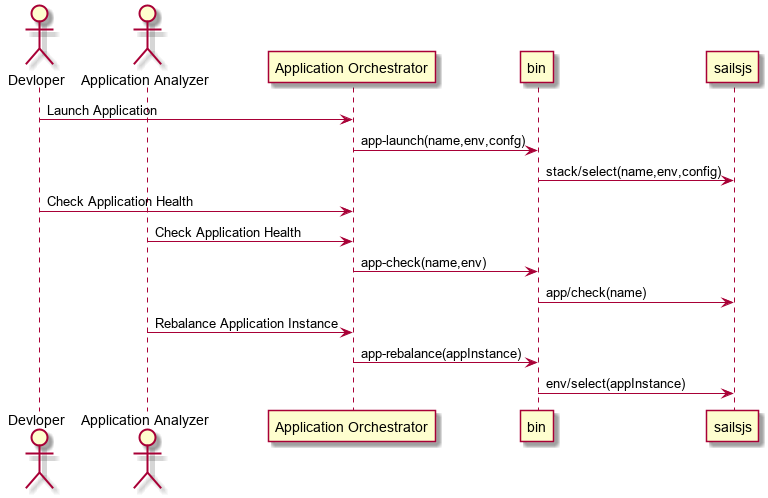
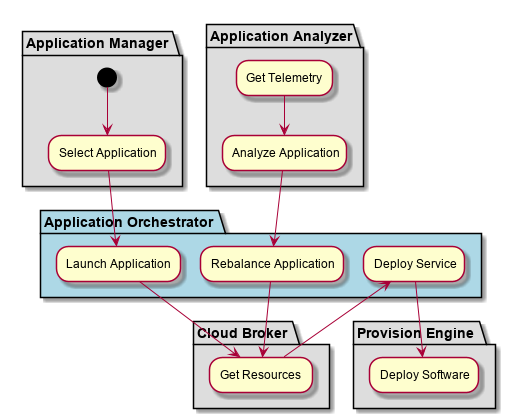

.. _SubSystem-Application-Orchestrator:

Application Orchestrator
========================

Application Orchestrator is responsible for taking the Application Stack
definition and coordinating the provisioning of resources in the Cloud
through the Cloud Broker. And then installing and configuring software
stacks on the resources in a coordinated manner.

Use Cases
---------

* :ref:`Scenario-Launch-Application`
* :ref:`Scenario-Rebalance-Application`
* :ref:`Scenario-Check-Application-Health`

.. image:: UseCases.png

Users
-----

* :ref:`SubSystem-Identity-Manager`
* :ref:`SubSystem-Telemetry`
* :ref:`SubSystem-Application-Manager`
* :ref:`SubSystem-Application-Analyzer`

Uses
----

* :ref:`SubSystem-Cloud-Broker`
* :ref:`SubSystem-Provision-Engine`
* :ref:`SubSystem-Data-Coordinator`

Interface
---------

* CLI - Command Line Interface
* REST-API -
* Portal - Web Portal

Logical Artifacts
-----------------

* ApplicationInstance - Running Application
* ServiceInstance - Running Service

Activities and Flows
--------------------
* Select an Application
* :ref:`Scenario-Launch-Application`
* Rebalance Application
* Deploy Service
* Deploy Software

Launch Application
~~~~~~~~~~~~~~~~~~
When an application is launched the environment and application are used to select a "Stacklet"
A Stacklet is an version of the Stack for the specific environmentment. The Stacklet defines
what services, configuration, and policies are established for the paplication in the environment.
Once the Stacklet is chosen (Simple selection application + environment) then the stacklet is traversed
to find the services for the environment. Since Services can be simple (Simple image to instantiate)
or complex (a aggregated nested network of services). The Services are travered to create a graph of
Service Instances that are aggregated just as the Service graph is laid out.

A design decision was made to only bind the Service graph to the application when the application is launched.
This late binding allows for quick changes to the application deinition through modification to service definitions.
To limit the amount of change to the application stack, a version of the stacks can be used to "lock in" a
specific version of the service definitions (stacks). The late binding also gives the ability to change multiple
micro-services at the same time and test the changes in different environments, quickly without the lengthy process.

** Mapping Service Insances to Cloud Resources **

Instead of sending individual requests to the cloud broker a decision was made to send multiple requests at the same
time giving the cloud broker the ability to map responses to the requests in batches instead of individually.
This should increase thruput and give flexiibility to the Application Orchestrator. It cna send individual request
or an array of requests. An example of a single request to the cloud broker is as follows:

.. code:: javascript

  let request = { instance:serviceInstance, policies: [], requirements: [
    {type: 'compute', quantity: 1},
    {type: 'storage', name:'myStorage', quantity:1000},
    {name:'myNetwork', quantity:2}
  ]};

The design decision has to be made on when to ask for the requests of the Cloud Broker. While the Service graph is being
traversed and created, or after the complete graph is created and then sent as one big request to the brokers.

** Design Discussion **
July 15, 2018

    Should I get resources right now. Or map the resources at the highest level of the Service graph.

    **Pros**:
    If I map them right now I can reuse this method to incrementally add instances
    and the resources cooresponding to them.

    **Cons:**
    If I push this to the top then I only have to do the mapping or request to the cloud
    broker once with the complete set of requests. This could mean I could optimize before I send the request.
    This is find for the first request coming from launch but there would be no advantage during the subsquent
    incremental change in service increments or decrements. For now leave it here to get the basic functionality
    working

Deployment Architecture
-----------------------

.. image:: Deployment.png

Physical Architecture
---------------------

