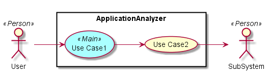
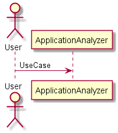
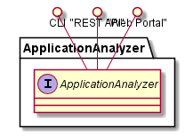
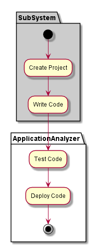
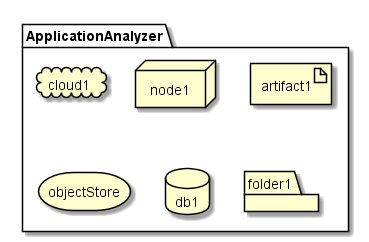
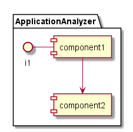

.. _SubSystem-Application-Analyzer:

Application Analyzer
====================

The Application Analyzer is responsible for building deep learning models of application stacks,
their services and resources they run and consume to optimize the execution landscape for the application.

Use Cases
---------

* :ref:`UseCase-Manage-Applications`

Users
-----
* :ref:`Actor-Developer`

Uses
----
* :ref:`Subsystem-Application-Analyzer`

Interface
---------
* CLI - Command Line Interface
* REST-API -
* Portal - Web Portal

Logical Artifacts
-----------------

Activities and Flows
--------------------

Deployment Architecture
-----------------------

Physical Architecture
---------------------

