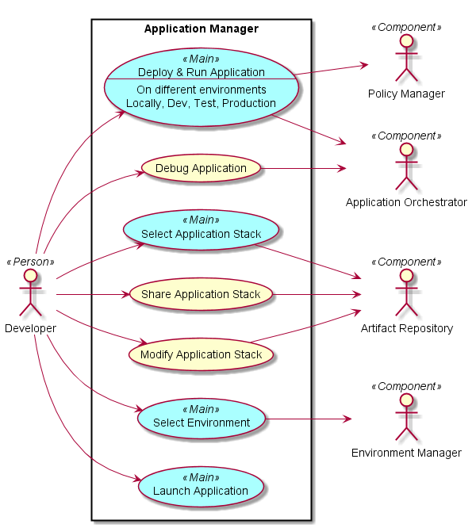
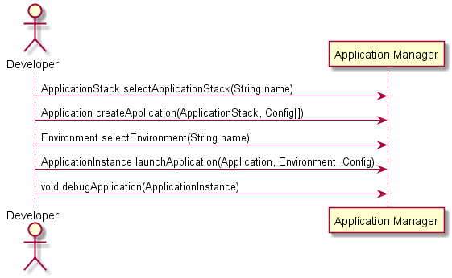
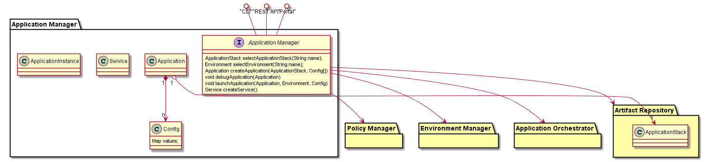

.. _SubSystem-Application-Manager:

Application Manager
===================

Application Manager is the primary interface for the Application Developer for C3.
It enables the developer to Use Application Stacks to rapidly develop, debug and deploy
"Cloud Aware" applications.

Use Cases
---------

* :ref:`Scenario-LaunchApplication`
* Select Application Stack
* Select Environment
* Debug Application
* :ref:`Scenario-CreateApplicationStack`
* :ref:`Scenario-UpdateApplicationStack`
* Remove Application Stack

Users
-----
* :ref:`Actor-ApplicationDeveloper`

Uses
----
* :ref:`SubSystem-Policy-Manager`
* :ref:`SubSystem-Environment-Manager`
* :ref:`SubSystem-Application-Orchestrator`
* :ref:`SubSystem-Artifact-Repository`

Interface
---------
* CLI - Command Line Interface
* REST-API -
* Portal - Web Portal

Artifacts
---------
* Application
* Application Stack
* Service

Services
--------

