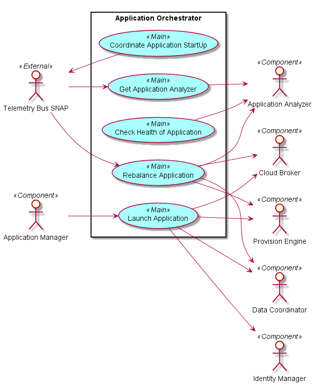
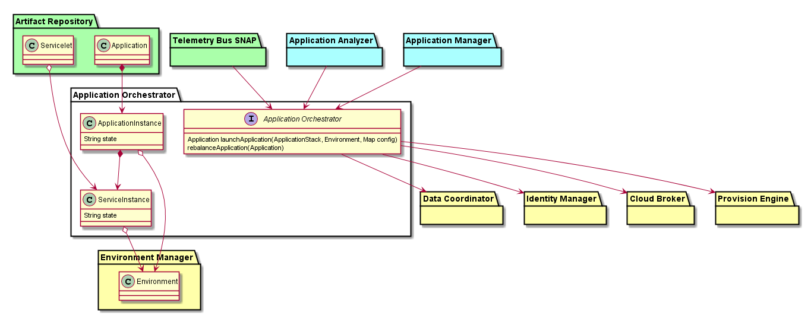
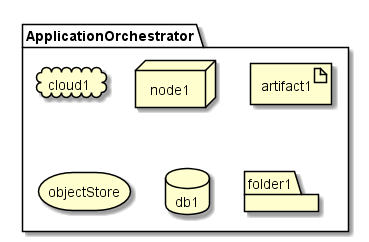
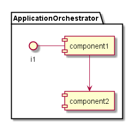

.. _SubSystem-Application-Orchestrator:

Application Orchestrator
========================
Application Orchestrator is responsible for taking the Application Stack
definition and coordinating the provisioning of resources in the Cloud
through the Cloud Broker. And then installing and configuring software
stacks on the resources in a coordinated manner.

Use Cases
---------

Users
-----
* :ref:`SubSystem-Cloud-Broker`
* :ref:`SubSystem-Provision-Engine`
* :ref:`SubSystem-Data-Coordinator`
* :ref:`SubSystem-IdentityManager`
* Telemetry Bus SNAP
* :ref:`SubSystem-ApplicationManager`
* :ref:`SubSystem-ApplicationAnalyzer`

Uses
----
* :ref:`Scenario-LaunchApplication`
* Rebalance Application
* Get Application Analyzer
* Check Health of Application
* Coordinate Application StartUp

Interface
---------

**Rest API**

Artifacts
---------
* ApplicationInstance
* ServiceInstance

Deployment
----------

Physical
--------

Services
--------

TBD
