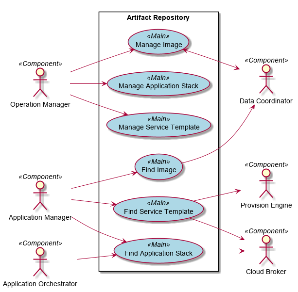
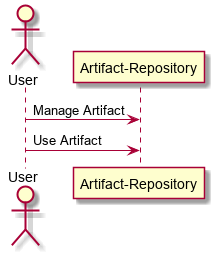
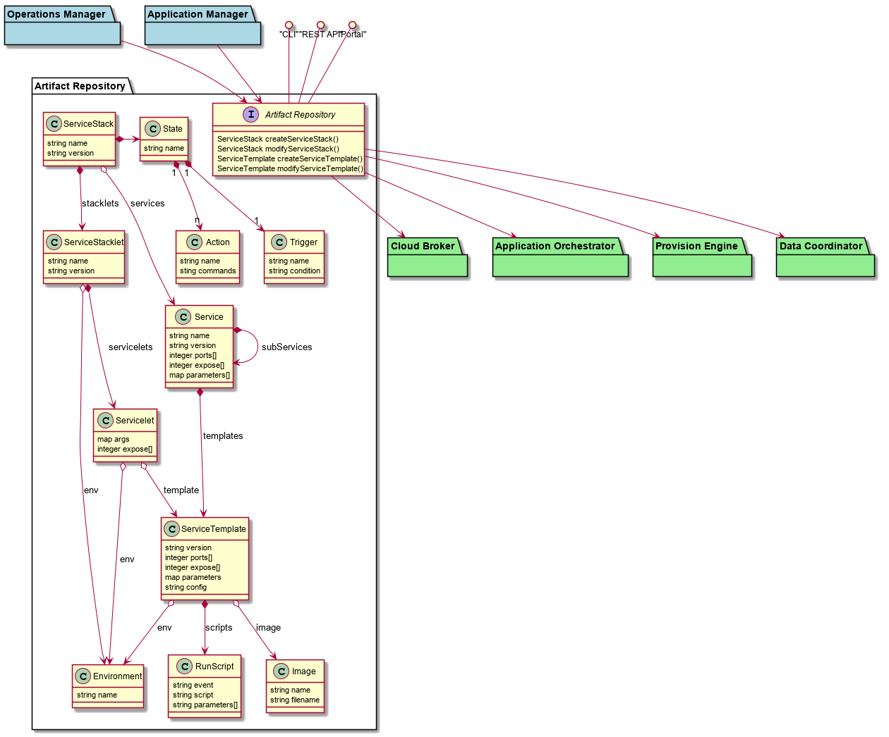
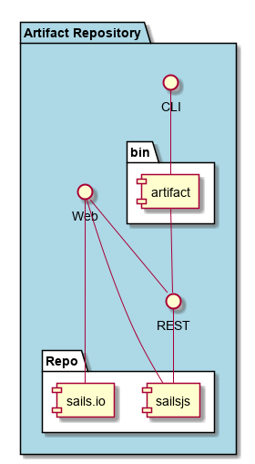

.. _SubSystem-Artifact-Repository:

Artifact Repository
===================

Artifact-Repository is a subsystem of c3 ...

Use Cases
---------

*

Users
-----

* :ref:`Actor-Stack-Developer`
* :ref:`Actor-Operations-Manager`
* :ref:`Actor-Application-Developer`
* :ref:`SubSystem-Application-Manager`

Uses
----

* :ref:`SubSystem-Artifact-Repository`

Interface
---------

* CLI - Command Line Interface
* REST-API -
* Portal - Web Portal

Logical Artifacts
-----------------

*

Activities and Flows
--------------------

Deployment Architecture
-----------------------

Physical Architecture
---------------------

