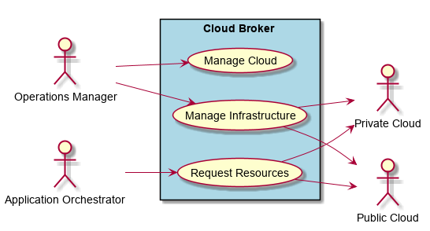

.. _SubSystem-Cloud-Broker:

Cloud-Broker
============

Cloud Broker is responsible for allocating resources on the Clouds attached to C3. Based of policies it will
select the "right" cloud or clouds for the application to run. This can include selecting multiple clouds
for complex hybrid cloud workloads. It is the main interface to the SDI Public and Private clouds.
Including VMWare, Containers, OpenStack, AWS, Google Cloud, etc...

Use Cases
---------

* :ref:`UseCase-Manage-Infrastructure`
* :ref:`UseCase-Manage-Clouds`

Users
-----

* :ref:`SubSystem-Application-Orchestrator`

.. image:: UserInteraction.png

Uses
----

* Cloud

Interface
---------

* CLI - Command Line Interface
* REST-API -
* Portal - Web Portal

Logical Artifacts
-----------------

* Resource
* Compute Resource
* Storage Resource
* Network Resource
* Cloud

.. image:: Logical.png

Activities and Flows
--------------------

.. image::  Process.png

Deployment Architecture
-----------------------

.. image:: Deployment.png

Physical Architecture
---------------------

