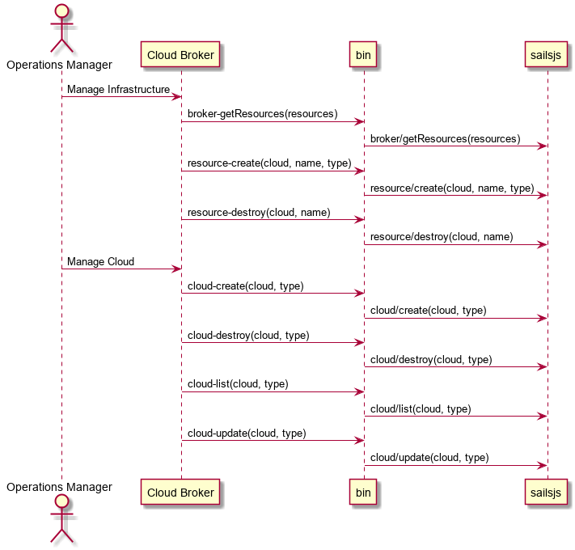

.. _SubSystem-Cloud-Broker:

Cloud-Broker
============

Cloud Broker is responsible for allocating resources on the Clouds attached to C3. Based of policies it will
select the "right" cloud or clouds for the application to run. This can include selecting multiple clouds
for complex hybrid cloud workloads. It is the main interface to the SDI Public and Private clouds.
Including VMWare, Containers, OpenStack, AWS, Google Cloud, etc...

Use Cases
---------

* :ref:`UseCase-Manage-Infrastructure`
* :ref:`UseCase-Manage-Clouds`

.. image:: UseCases.png

Users
-----

* :ref:`SubSystem-Application-Orchestrator`

Uses
----

* :ref:`SubSystem-Policy-Engine`
* Cloud

Interface
---------

* CLI - Command Line Interface
* REST-API -
* Portal - Web Portal

Logical Artifacts
-----------------

* Resource - Virtual Representation of the hardware. This can be a VM, Bare metal, or container.
* Cloud - SDI Cloud that is connected to the data center
* Request - Request tied to a Service Instance. This is sent to the Cloud to request resources. The cloud in response is a reservation.
* Resource Request - Each request has 1..n Resource Requests. This could be compute, network, storage or accelerator.
* Reservation - This is the response to a request.

Activities and Flows
--------------------

When an application is launched or rebalanced the Cloud broker takes the reguest of requirements for the service graph,
and then evaluates the policies across the service graph, environment, and clouds. Then the Cloud Broker sends requests
to each Cloud in the form of a resource requests which Service Instances with Resource Requests.
Each request is sent to the individual request. In repsonse a reservation is returned from the cloud. A reservation has
a "good til" time on it. Each Cloud will return a set of reservations that can be used to satisfy the request requirements.
A set of reservations is then selected by the cloud broker and the rest or released/destroyed. Then a set of resources
are then mapped to the reservations and the Service Instances are mapped to the resources.

Deployment Architecture
-----------------------

Physical Architecture
---------------------

.. image:: Physical.png

