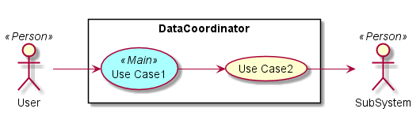
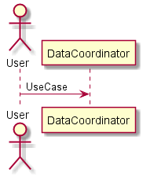
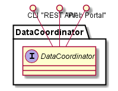
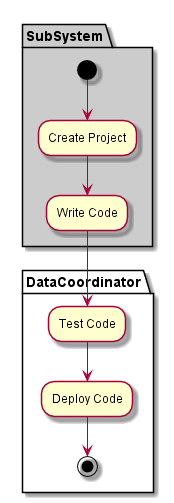
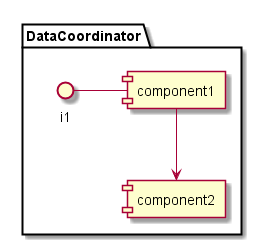

.. _SubSystem-Data-Coordinator:

Data Coordinator
================
Data Coordinator is responsible for making sure that data is the right place at the right time.
This includes: images on the proper cloud, data for the application, and data movement for business continuity
and disaster recovery based on the policies of C3. Examples include making sure images across clouds are identical.

Use Cases
---------

Users
-----

Uses
----
* :ref:`SubSystem-Data-Coordinator`

Interface
---------
* CLI - Command Line Interface
* REST-API -
* Portal - Web Portal

Logical Artifacts
-----------------

Activities and Flows
--------------------

Deployment Architecture
-----------------------
.. image::Deployment.png

Physical Architecture
---------------------

