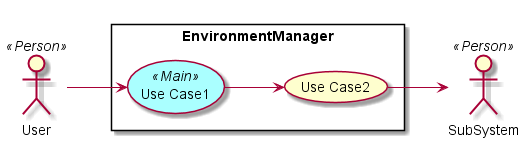
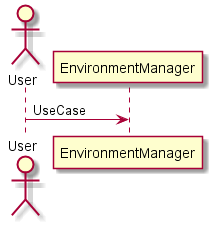
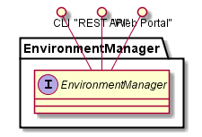
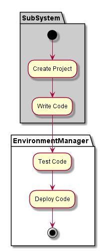
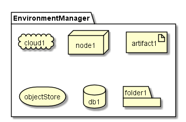
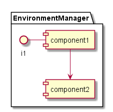

.. _SubSystem-Environment-Manager:

Environment Manager
===================

Environment Manager manages the environments in C3. An Environment represents a segment of the
clouds that are targeted for specific type of work during the development cycle. For example a C3
instance might have a Development, Test, UAT, and Production Environment. Application Stacks have a
definition for each Environment. When a developer launchs and Application they select the environment
they want it running on.

Use Cases
---------

Users
-----

Uses
----
* :ref:`SubSystem-Environment-Manager`

Interface
---------
* CLI - Command Line Interface
* REST-API -
* Portal - Web Portal

Logical Artifacts
-----------------

Activities and Flows
--------------------

Deployment Architecture
-----------------------

Physical Architecture
---------------------

