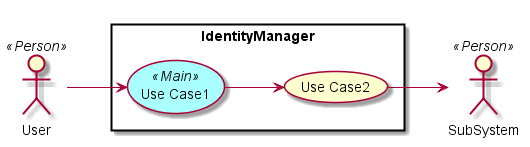
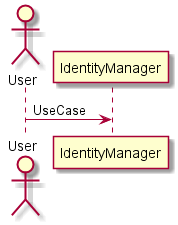
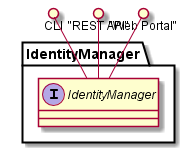
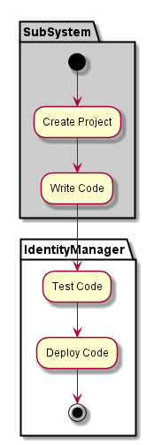
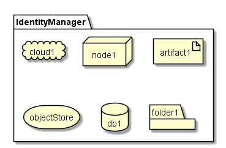
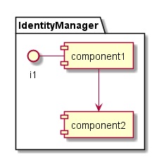

.. _SubSystem-Identity-Manager:

Identity Manager
================
Identity Manager allows Operators to manage the identity of users of C3 acros multiple Clouds.
It stores creds, SSH Keys, etc. that allow C3 to act in behalf of the user across multiple
Clouds that have different authentication and authorization.

Users
-----
* :ref:`Actor-Operations-Manager`
* :ref:`Actor-Application-Developer`

Use Cases
---------

Users
-----

Uses
----
* :ref:`SubSystem-Identity-Manager`
*

Interface
---------
* CLI - Command Line Interface
* REST-API -
* Portal - Web Portal

Logical Artifacts
-----------------

Activities and Flows
--------------------

Deployment Architecture
-----------------------

Physical Architecture
---------------------

