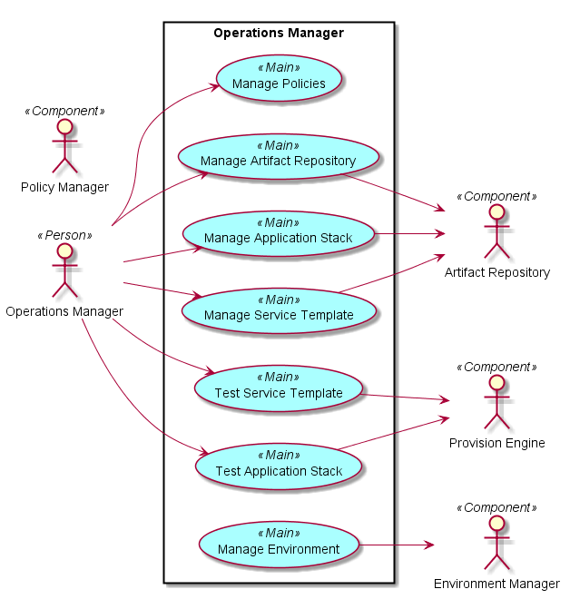
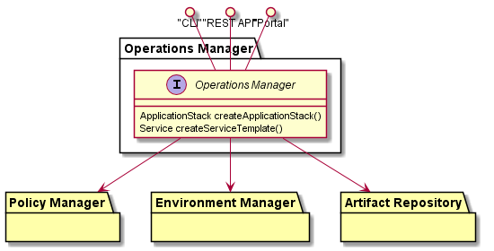
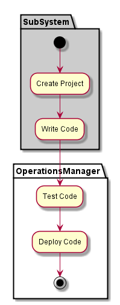
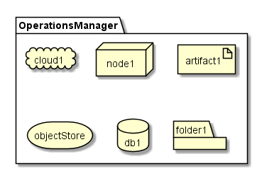
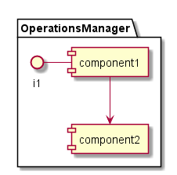

.. _SubSystem-Operations-Manager:

Operations Manager
==================
Operations Manager is responsible for giving the operator the ability to create
Service Templates, Application Stacks, Evnrionments and policies reguarding those elements.
This is the main interface for the C3 Operator.

Use Cases
---------
* :ref:`Scenario-Create-Environment`
* :ref:`Scenario-Create-Application-Stack`
* :ref:`Scenario-Create-Service-Template`
* :ref:`Scenario-Modify-Service-Template`
* :ref:`Scenario-Update-Application-Stack`
* :ref:`Scenario-Test-Service-Template`
* :ref:`Scenario-Test-Application-Stack`
* :ref:`UseCase-Manage-Artifact-Repository`
* :ref:`Scenario-Manage-Policies-For-Environment`
* :ref:`Scenario-Manage-Policies-For-Application-Stack`
* :ref:`Scenario-Modify-Environment`

Users
-----
* :ref:`Actor-Operations-Manager`

Uses
----
* :ref:`SubSystem-Policy-Manager`
* :ref:`SubSystem-Environment-Manager`
* :ref:`SubSystem-Provision-Engine`
* :ref:`SubSystem-Artifact-Repository`

Interface
---------
* CLI
* REST-API
* Portal

Logical Artifacts
-----------------

Activities and Flows
--------------------

Deployment Architecture
-----------------------

Physical Architecture
---------------------

Example Application Stack
-------------------------

.. code-block:: none

    version: 3
    services:
      web:
        ports: 1337
        expose: 1337
        parameters:
          - name: MyName
          - location: MyLocation
      redis:
        ports: 6379
      mongo:
        ports: 27017

