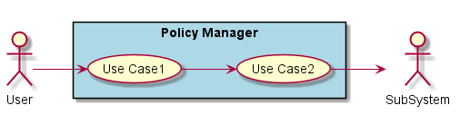
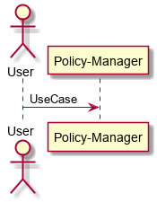
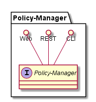
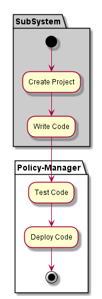
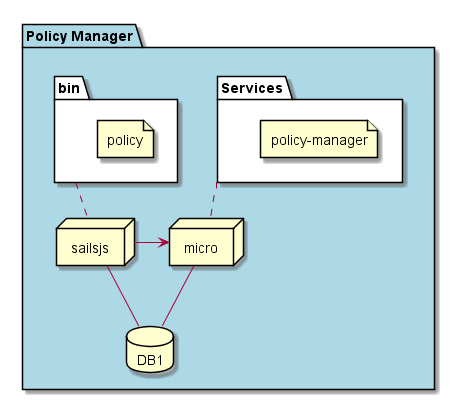

.. _SubSystem-Policy-Manager:

Policy Manager
==============

Policy Manager is a subsystem of c3 ...

Use Cases
---------

*

Users
-----

* :ref:`Actor-User`

Uses
----

* :ref:`Policy-Manager`

Interface
---------

* CLI - Command Line Interface
* REST-API -
* Portal - Web Portal

Logical Artifacts
-----------------

*

Activities and Flows
--------------------

Deployment Architecture
-----------------------

Physical Architecture
---------------------

.. image:: Physical.png

