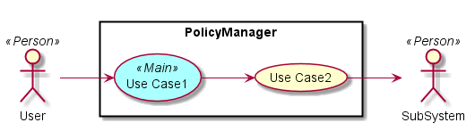
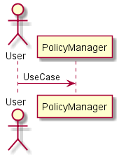
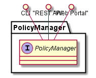
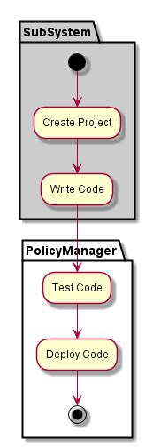
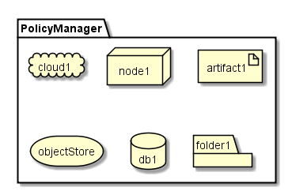
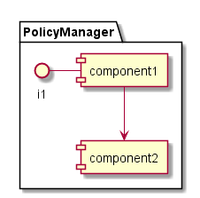

.. _SubSystem-Policy-Manager:

Policy Manager
==============
Policy Manager is responsible for the management of policies in C3. Policies can be applied to
environments, application stacks, groups of people or individuals. Policies help enforce Quality of Service
and Service Level Agreements for applications in environments for specific tenents in the Cloud.

Users
-----
* :ref:`Actor-Operations-Manager`

Use Cases
---------

Users
-----

Uses
----
* :ref:`SubSystem-IdentityManager`
*

Interface
---------
* CLI - Command Line Interface
* REST-API -
* Portal - Web Portal

Logical Artifacts
-----------------

Activities and Flows
--------------------

Deployment Architecture
-----------------------

Physical Architecture
---------------------

