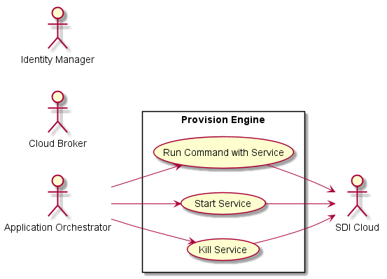
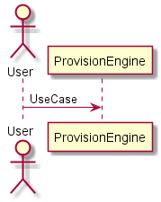
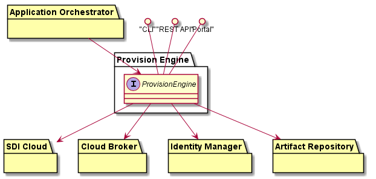
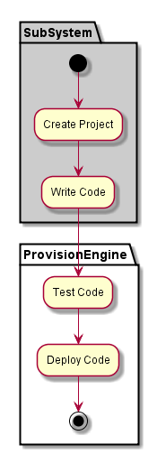
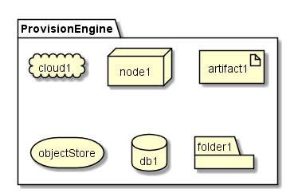
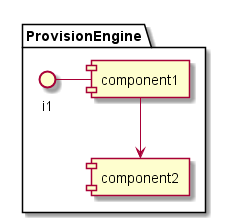

.. _SubSystem-Provision-Engine:

Provision Engine
================
The Provision Engine is responsible for making sure the resources have the correct software installed
and configured for the services and applications that are running. It must be able to provision software
based on the Service Templates and the Application Stacks.

Use Cases
---------
* :ref:`Scenario-Start-Service`
* :ref:`Scenario-Kill-Service`
* :ref:`Scenario-Run-Command`

Users
-----
* :ref:`SubSystem-Application-Orchestrator`

Uses
----
* :ref:`SubSystem-SDI-Cloud`
* :ref:`SubSystem-Identity-Manager`

Interface
---------
* CLI - Command Line Interface
* REST-API -
* Portal - Web Portal

Logical Artifacts
-----------------

Activities and Flows
--------------------

Deployment Architecture
-----------------------

Physical Architecture
---------------------

