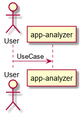
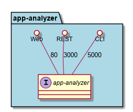
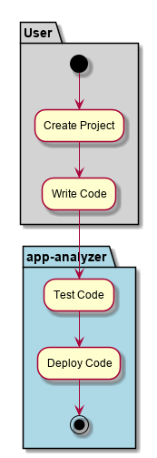
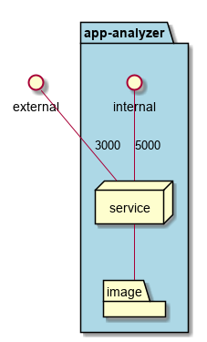
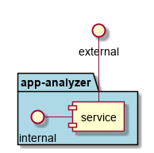

.. _Service-app-analyzer:

app-analyzer
============

app-analyzer is a micro-service of C3 Architecture and implements parts of the :ref:`SubSystem-Application-Analyzer`

Use Cases
---------

*

.. image:: UseCases.png

Users
-----

* :ref:`SubSystem-Application-Analyzer`

Uses
----

* :ref:`SubSystem-Application-Analyzer`

Interface
---------

* CLI - Command Line Interface
* REST-API -
* Portal - Web Portal

Logical Artifacts
-----------------

*

Activities and Flows
--------------------

Deployment Architecture
-----------------------

Physical Architecture
---------------------

