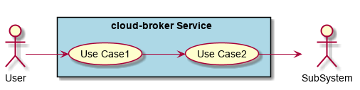
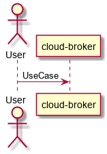
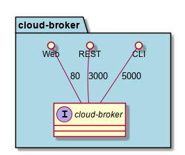
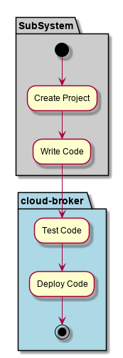
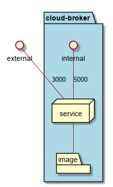
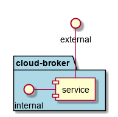

.. _Service-cloud-broker:

cloud-broker
============

cloud-broker is a micro-service of c3 ...

Use Cases
---------

*

Users
-----

* :ref:`Actor-Operations-Manager`

Uses
----

* :ref:`SubSystem-Cloud-Broker`

Interface
---------

* CLI - Command Line Interface
* REST-API -
* Portal - Web Portal

Logical Artifacts
-----------------

*

Activities and Flows
--------------------

Deployment Architecture
-----------------------

Physical Architecture
---------------------

