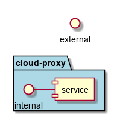

.. _Service-Cloud-Proxy:

cloud-proxy
===========

cloud-proxy is a micro-service of c3 ...

Use Cases
---------

*

.. image:: UseCases.png

Users
-----

* :ref:`Actor-Operations-Manager`

.. image:: UserInteraction.png

Uses
----

* :ref:`Service-Cloud-Proxy`

Interface
---------

* CLI - Command Line Interface
* REST-API -
* Portal - Web Portal

Logical Artifacts
-----------------

*

.. image:: Logical.png

Activities and Flows
--------------------

.. image::  Process.png

Deployment Architecture
-----------------------

.. image:: Deployment.png

Physical Architecture
---------------------

